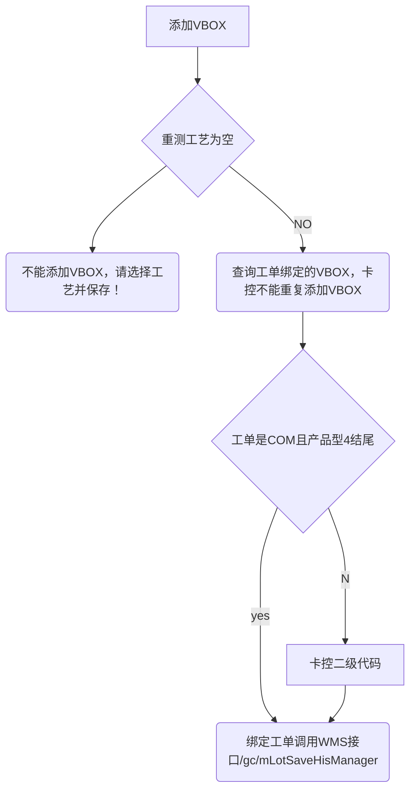

# 编辑
## 初始化工单信
1. 获取工单表信息，判断工单是否存在，重测晶圆型号是否配置，再返回data
## 初始化VBOX
1. 根据工单rrn获取WORK_ORDER_RELATION表所有OBJECT_TYPE = ‘WO_RETEST_VBOXdata

# VBOX
## 查询

```
WMS_MMS_MATERIAL_LOT

STATUS IN ( 'In', 'Package')
HOLD_STATE = 'Off'

MATERIAL_LOT_ID NOT IN (SELECT LOT_ID FROM LOT)
AND MATERIAL_LOT_ID NOT IN 
(SELECT OBJECT_ID FROM WORK_ORDER_RELATION OBJECT_TYPE = 'WO_RETEST_VBOX')
```

# 添加Vbox





> [!NOTE] 卡控二级代码
> 从后往前截取最后一位大写字母来获取该大写字母在二级代码中的索引位置，然后从该索引开始截取二级代码后面的所有字符，然后返回


```java
public String getReferenceCode(String secondCode) throws MyCimException {  
    StringBuffer tmp = new StringBuffer();  
    char[] chars = secondCode.toCharArray();  
    for (int i = chars.length - 1; i >= 0; i--) {  
       if (StringUtils.isNotEmpty(String.valueOf(chars[i])) && 'A' <= chars[i] && chars[i] <= 'Z') {  
          tmp.append(chars[i]);  
          break;  
       }  
    }  
    int subScript = secondCode.lastIndexOf(tmp.toString());  
    int length = secondCode.length();  
    String referenceCode = secondCode.substring(subScript,length);  
    return referenceCode;  
}
```

# 查询真空导入查询


```SQL
SELECT
	*
FROM
	WMS_MMS_MATERIAL_LOT
WHERE
	STATUS IN ( 'In', 'Package')
	AND HOLD_STATE = 'Off'
	AND MATERIAL_NAME IN (
	SELECT
		P.INSTANCE_ID
	FROM
		NAMED_OBJECT O,
		RELATION R,
		NAMED_OBJECT P
	WHERE
		O.INSTANCE_ID = 'GC13023-MAFD0-4.7'
		AND O.INSTANCE_RRN = R.FROM_RRN
		AND P.INSTANCE_RRN = R.TO_RRN
		AND R.LINK_TYPE = 'PRODUCT_TO_RTPRODUCT')
	AND MATERIAL_LOT_ID NOT IN (
	SELECT
		LOT_ID
	FROM
		LOT)
	AND MATERIAL_LOT_ID NOT IN (
	SELECT
		OBJECT_ID
	FROM
		WORK_ORDER_RELATION
	WHERE
		FACILITY_RRN = '1'
		AND OBJECT_TYPE = 'WO_RETEST_VBOX')
	AND MATERIAL_LOT_ID = '1'
	AND MATERIAL_NAME = '1'
	AND GRADE = '1'
	AND RESERVED6 = '1'
	AND RESERVED16 IS NULL
```

# 页面初始

查询是否已经投批了（retest），有的话设置Y

```java
//TODO 标识：产品是否转型号  
wfo.setProductIdTransfer("N");  
if (prpSetupService.judgeProductIdTransfer(workOrder.getWorkorderRrn())) {  
    wfo.setProductIdTransfer("Y");  
}
```

```sql
 SELECT
	mpl.LEVEL_TWO_CODE,
	w.LEVEL_TWO_CODE,
	wor.*
FROM
	WORK_ORDER_RELATION_H wor,
	MM_PACKED_LOT mpl,
	WORKORDER w WHERE  wor.TRANS_TYPE = 'retest'  AND wor.WORK_ORDER_RRN = '5511636' AND mpl.BOX_ID = wor.OBJECT_ID
	AND w.WORKORDER_RRN = wor.WORK_ORDER_RRN
	AND mpl.PRODUCT_ID != w.PRODUCT_ID
```