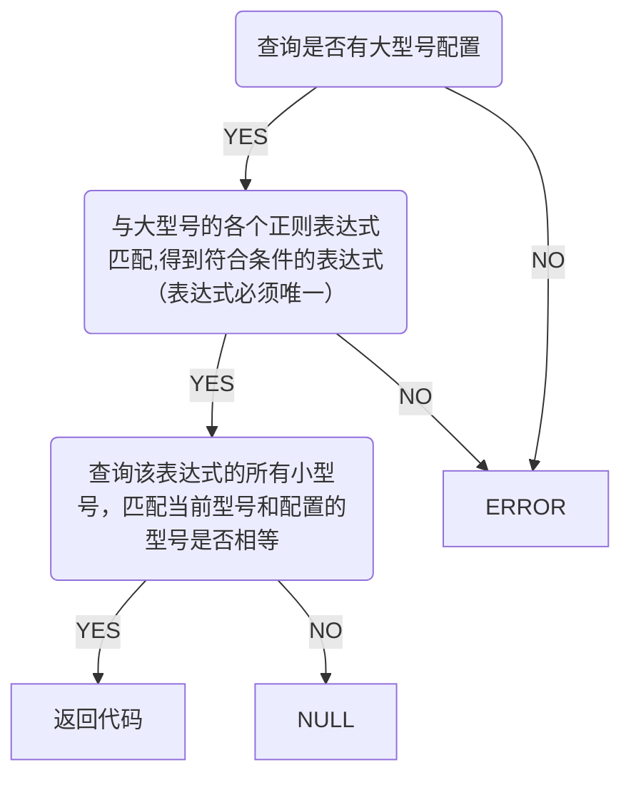
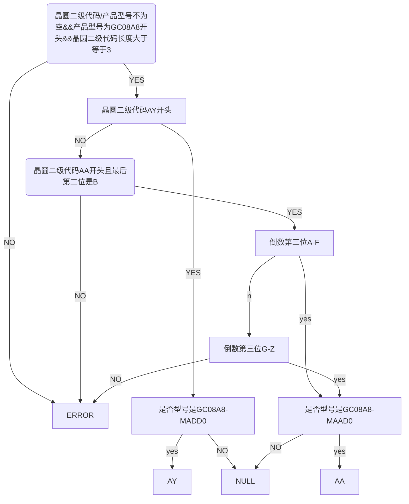
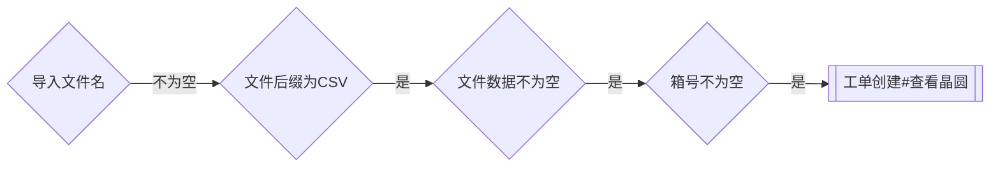
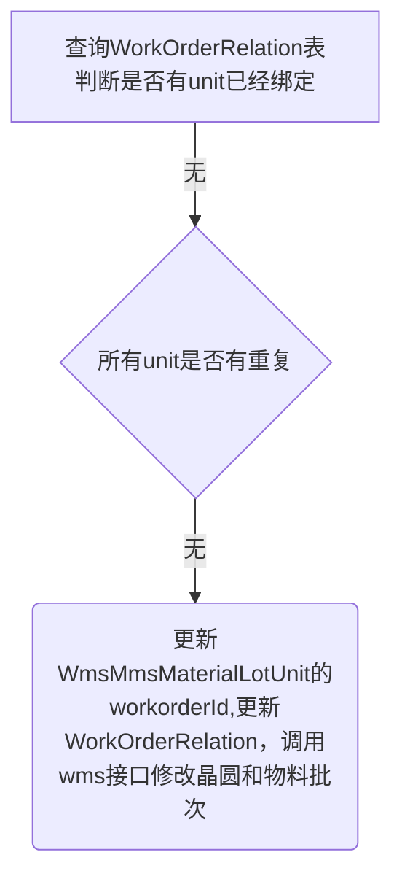

# 创建

> [!summary] 功能描述
> 1. 点击创建按钮，进入信息页面，需要填写基础信息，但是二级代码无法填写且需要必填才能创建——工单无法创建
> 2. 点击创建不会传入所填工单号


# 🌟编辑
## 初始化工单信息
1. 进入信息页面，根据工单号获取工单表（WORKORDER）信息，若工单不存在则报错
2. 获取工单信息后，额外[^1]获取程序类型

```
if(!StringUtils.equals(WorkOrder.COM, wfo.getProductClassify())){  
   session.setAttribute("unconditionalAddWaferFlag", WorkOrder.TRUE);  
}else{  
   session.setAttribute("unconditionalAddWaferFlag", WorkOrder.FALSE);  
}  
if(wfo.getComponentMaterialId() != null){  
   session.setAttribute("addWaferFlag", WorkOrder.TRUE);  
}else{  
   session.setAttribute("addWaferFlag", WorkOrder.FALSE);  
}
```

3. 从二级代码最末尾的大写字母开始，截取后面所有字符串并返回为referenceCode
4. 根据产品rrn获取对应的物料清单号rrn
```sql
select RESULT_VALUE1 from CONTEXT_VALUE WHERE CONTEXT_KEY1 ='" + instanceRrn + "'
```

5. 若物料号不为空，根据 3 中的referenceCode查询所有的bor_rrn，将所有borrrn转为ID，对比4中获取的物料清单号相同且是BOM类型的情况下，添加获取所有RESOURCE_RRN，且转为ID形式。直到循环所有borrrn返回组件料号
```sql
--5.1
select BOR_RRN from BILL_OF_RESOURCE WHERE CONTRAST_CODE ='" + referenceCode + "'

--5.2
select RESOURCE_RRN from BILL_OF_RESOURCE WHERE BOR_RRN ='" + borRrn + "' and CONTRAST_CODE ='"+referenceCode+"'
```

6. 若工单的COM_LINE_TYPE = 9，inline线，界面批标准数量设定为inLineLotQty；其余类型为QUANTITY_OF_WARNING，根据产品rrn查表获取
```sql
SELECT i.INLINE_LOT_QTY, i.QUANTITY_OF_WARNING , i.* FROM item i where item_rrn = ?;
```

## 初始化晶圆列表
1. 根据工单rrn获取WORK_ORDER_RELATION表所有OBJECT_TYPE = ‘WO_RESEVED_MLOT’ 的绑定晶圆
2. 循环所有晶圆，以一条为例
	1. 获取WmsMmsMaterialLotUnit，晶圆号查询UNIT_ID和箱号查询MATERIAL_LOT_ID字段，STATE IN ('Issue','In','Create','Package')的数据。
	2. 若存在，则先根据unitid获取LOT_INVENTORY表记录，若存在，剩余数量为lotInventory.getReceiptQty()-lotInventory.getIssueQty()；若不存在剩余数量 wmsMmsMaterialLotUnit.getReceiveQty().longValue()
	3. 若不存在，获取BACKEND_WAFER_RECEIVE，如果也不存在，直接下一循环，否则根据unitid获取LOT_INVENTORY表记录，若存在，剩余数量为lotInventory.getReceiptQty()-lotInventory.getIssueQty()；若不存在剩余数量为0
3. 得到剩余数量后，返回数据

# 保存
1. 若为COM工单
	1. 晶圆属性和晶圆等级不相等，OA单号必填
	2. 程序类型不能为空
	3. 更新对照码，组件料号不能为空
		1. 组件料号不为空时：session.setAttribute("addWaferFlag", WorkOrder.TRUE);
2. WORK_ORDER_TYPE为3，且不是RW工单，报错
3. 计算投入数是否小于在线数+报废数+完成数+建批数，是则 报错
4. 更新表单信息

# 关闭
1. 若lotplan表有建批数据，不可关闭
# 删除
1. 若lotplan表有建批数据，不可删除
2. 若WorkOrderRelation有数据，不可删除

# 🌟晶圆


## 查看晶圆
1. 判断工单类型获取晶圆型号
	1. 若是RW工单且为Recon或工程试验，根据产品型号查绑定的重测晶圆型号materialInfo
	2. 其他情况根据产品型号查绑定的晶圆型号materialInfo；
2. 判断工单类别，是否查询晶圆属性设定表
	1. FT(1),WLFT(2),WLT(3),SENSOR_CP(5),LCD_CP(6)，直接查询unit表，并返回数据
	2. 其他，查询晶圆属性设定表，再查询unit表
		1. 卡控1：晶圆二级代码与产品型号
		2. 卡控2：核对晶圆是否有备注，如有备注一律不可开量产工单,特殊备注除外
		3. 卡控3：核对箱号是否卡控指定投产型号
```sql
WMS_MMS_MATERIAL_LOT_UNIT
--固定
A.WORK_ORDER_ID IS NULL
A.STATE in ('Issue','In','Package')
AND A.RESERVED50 = '16'
--传参
A.MATERIAL_NAME = ?
A.RESERVED4 = ? --工单报税属性
--可选
A.LOT_ID = ?
A.UNIT_ID = ?
```
### 卡控1：晶圆二级代码与产品型号

#### 2025/2/10 更新日志
> [!important] 2025/2/10 需求
> MES系统工单投料卡控，AA等级GB之后wafer投料增加GC08A8-MADD0型号，对应COM芯片真空包二级代码末尾2位为AA区分
> 
> *（新增型号为暂时方案，预计持续2个月，之后不再卡控该型号，所以稳妥方式是卡控工单号执行，其余工单的该型号保持不变）*
##### 🌟正则表达式
突然发现可以使用正则表达式匹配晶圆的二级代码，每个型号对应一个或多个正则表达式。~~使用正则表达式后流程图简便了很多~~
例：`^AY.*[A-F]B.$`
**解释：**
- `^AY`：确保字符串以 "AY" 开头。
- `.*`：匹配任意数量（包括零个）的任意字符。
- `[A-F]`：匹配倒数第三个字符，范围在 A 到 F 之间。
- `B`：匹配倒数第二个字符为 "B"。
- `.$`：最后一个字符可以是任意字符，并确保字符串结束。


##### 数据表设计


> [!danger] 正则表达式为用户配置，默认不存在下面问题，正则匹配都为独立的
> 正则表达式不能有交集，比如匹配任意AY开头和匹配任意A开头两个正则，存在A···· 的字符都满足，导致两条规则有两个型号，但是本身 A···· 只卡控A开头的型号，会导致也卡AY开头的型号

#### 2025/2/10前流程图

- NULL：二级代码符合规则，但工单不是对应的产品型号，不做卡控
- ERROR：二级代码不符合规则或型号不符合规则
- 代码：二级代码和型号都符合规则


## 导入
### 导入模板

| BOXID(LOT ID) |
| ------------- |
|               |

### 导入查询



## 添加



[^1]: 查询数据表`WAFER_REGEX_CONFIG` 的`TEST_TYPE`，根据工单号查询`TYPE=4`