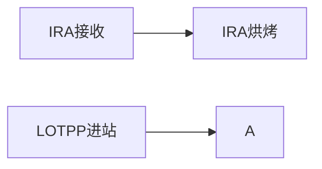

# PP上料与IRA烘烤

本文档用于说明 PP 产线 CIN 站在 IRA 烘烤、机台上料、Lot 出站三个环节上的业务变动。  
与工作流文档不同，这里重点写清楚业务背景、操作约束、系统行为、异常场景和最终实现方式，方便研发、测试、现场和后续维护人员统一理解。

## 一、业务背景

PP 机台在 CIN 站作业时，需要使用 IRA 物料。原有模式下，IRA 的接收、发料、退料能力已经存在，但现场希望把以下动作串起来，形成更顺手的操作闭环：

1. IRA 到料后，先在烘烤站完成烘烤确认；
2. 烘烤完成的 IRA 才允许在 PP 机台上料；
3. PP CIN 站 Lot 出站时，系统自动校验当前机台已上料的 IRA 是否满足消耗要求；
4. 校验通过后，系统自动完成 IRA 扣料，并继续执行 Lot 出站；
5. 操作完成后，现场能够看到机台剩余 IRA 数量，便于继续生产或安排换料。

这次改动的核心目标，不是单独再造一套 IRA 新业务，而是在现有 IRA 发料、机台上料、Lot 作业能力上做整合，让 PP CIN 站能直接在 MES 里完成整套动作。

## 二、适用范围

本次功能主要适用于以下场景：

1. 产品分类为 `COM` 的批次；
2. 站点为 `CIN` 的 PP 作业场景；
3. 设备已经维护 IRA 物料关联关系；
4. IRA 物料已经完成接收，并具备可入库、可上料条件。

不满足上述条件时，系统会直接拦截，避免错误出站或错误扣料。

## 三、业务变动总览

本次业务最终分成三段：

1. `IRA 烘烤`
   系统通过 IRA 烘烤动作，确认该批 IRA 已完成烘烤，同时补齐后续机台上料所需的库存基础数据。

2. `PP 机台上料/下料`
   通过接口将烘烤完成的 IRA 绑定到机台；如需撤下，也支持按批次下料。

3. `PP CIN 站 Lot 出站`
   Lot 在 CIN 站出站时，系统按照 BOM 和批次数量自动计算 IRA 消耗量，并从当前机台已挂载的 IRA 中依次扣减。

## 四、IRA 烘烤业务说明

### 1. 业务目的

IRA 烘烤不是单纯做一个状态标记，而是后续 PP 上料的前置条件。  
只有已经烘烤的 IRA，才允许进入 PP 机台上料流程。

### 2. 系统实现方式

最终实现没有单独新建一套“烘烤库存表”，而是复用了现有 IRA 发料入库能力：

1. 烘烤时先校验该 IRA 是否已经存在烘烤历史；
2. 若未烘烤，则继续检查库存里是否已存在该 IRA；
3. 若库存不存在，则调用现有 `iraMaterialIssue` 逻辑，将 IRA 生成线边库存记录；
4. 最后写入 `TRANS_BAKE` 的 IRA 历史，表示该 IRA 已完成烘烤。

这样处理后，烘烤动作既完成了业务确认，也保证了后续机台上料时，系统能够查到对应 IRA 库存。

### 3. 烘烤校验规则

烘烤时系统会校验：

1. IRA 批次必须存在；
2. IRA 不能重复烘烤；
3. IRA 数量必须大于 0；
4. IRA 失效日期必须晚于当前日期；
5. IRA 生产日期必须早于当前日期。

若任何条件不满足，系统直接报错，不允许烘烤通过。

### 4. 烘烤后的业务结果

烘烤成功后，系统层面会产生两个结果：

1. IRA 具备“已烘烤”业务资格，允许进入 PP 上料流程；
2. IRA 已具备线边库存数据，可被后续机台挂载和消耗。

## 五、PP 机台上料/下料业务说明

### 1. 上料目标

PP 机台在 CIN 站生产前，需要先把对应 IRA 上到设备上。  
这里的“上料”并不是简单记一条关系，而是走现有设备物料挂载机制，把 IRA 正式挂到设备。

### 2. 接口能力

当前使用接口：

`/EquipmentMaterialController/iraBind`

通过 `tranType` 区分动作：

1. `MOUNT`：上料
2. `UNMOUNT`：下料

同时支持：

1. 单个 IRA 上料/下料；
2. 多个 IRA 一次提交；
3. 返回当前机台剩余 IRA 数量 `leftNum`。

### 3. 上料限制

PP CIN 站上料时，系统增加了比较明确的控制规则：

1. 一次最多只允许上料 3 个 IRA；
2. IRA 必须已经完成烘烤；
3. IRA 批次必须存在；
4. IRA 库存状态不能是 `CLOSE`、`HOLD`、`RETURN`；
5. 同一批次 IRA 不能重复上料；
6. 设备必须真实存在；
7. IRA 对应物料必须存在；
8. IRA 必须能在库存中查到；
9. 如果设备当前已有运行批次，则待上料 IRA 必须符合该运行批次的 BOM；
10. 需要继续满足物料本身的有效期、装载下限、装载上限、有效次数、有效周期等规则。

也就是说，PP 上料虽然对现场来说只是“扫一下 IRA”，但系统背后实际做了比较完整的防呆。

### 4. 上料后的系统行为

上料成功后，系统会：

1. 更新该 IRA 的装载次数；
2. 记录上料时间；
3. 将当前 IRA 可用量写入设备物料挂载记录；
4. 作为后续 CIN 出站时的候选消耗物料。

### 5. 下料说明

如果需要撤料，则通过同一个接口做 `UNMOUNT`。

下料时系统会：

1. 校验该 IRA 是否存在；
2. 校验该 IRA 当前是否确实已绑定机台；
3. 累计本次挂载时长，回写到库存相关字段；
4. 执行卸料动作，移除机台挂载关系。

## 六、PP CIN 站 Lot 出站业务说明

### 1. 出站目标

PP CIN 站出站时，需要把“Lot 出站”和“IRA 扣料”打通。  
业务上希望做到：

1. 现场传入 Lot 和机台；
2. 系统自动判断该 Lot 此次出站需要消耗多少 IRA；
3. 从机台已上料的 IRA 中扣减；
4. 扣减成功后，再继续执行 Lot 正常出站。

### 2. 接口能力

当前使用接口：

`/EquipmentMaterialController/outIraLot`

接口支持：

1. 单批次出站；
2. 多批次同站点、同作业、同 BOM 合并出站；
3. 可指定本次使用的 IRA 批号；
4. 若不指定 IRA，系统按当前机台已挂载 IRA 自动参与分摊；
5. 返回本次消耗明细和出站后剩余量。

### 3. 出站前校验

Lot 在 CIN 站通过该接口出站前，系统会做以下校验：

1. `facilityId`、`userName`、`eqpmentId` 必须有效；
2. `lotId` 不能为空；
3. 批次必须存在；
4. 批次必须在当前设备上；
5. 批次必须存在有效作业信息；
6. 工步必须配置为记录物料；
7. 当前只允许 `CLN` 工步批次进入该逻辑；
8. 当前只允许 `COM` 线批次进入该逻辑；
9. 批次状态必须是可出站状态；
10. 多批次同时出站时，必须是同一工步、同一作业、同一 BOM；
11. 设备必须已维护 IRA 物料关联；
12. 若传入 IRA 批号，则这些 IRA 必须已经绑定到当前机台。

这些限制的目的，是保证这条出站接口只服务于 PP CIN 的目标场景，避免混入其他站点和其他业务。

### 4. IRA 消耗逻辑

系统在出站前，会先找出当前设备已挂载的 IRA 列表，并查询每个 IRA 的库存剩余量：

`剩余量 = receiptQty - issueQty + adjustQty`

随后按 Lot 对应 BOM 逐项计算本次需要消耗的物料数量。  
对于 IRA 物料，并且当前站点是 `CIN` 时，消耗量按以下方式计算：

`消耗量 = Lot 数量 × BOM 单位消耗`

系统会从机台当前已挂载的 IRA 中依次扣减，直到满足本次 Lot 出站需要。

如果出现以下情况，则出站会被拦截：

1. 机台没有挂料；
2. 挂载物料与 BOM 不匹配；
3. 机台挂载 IRA 数量不足；
4. 指定的 IRA 不在当前设备上；
5. 数据不完整，无法生成物料记录。

### 5. 出站成功后的系统行为

出站成功后，系统会：

1. 记录本次 Lot 与 IRA 的消耗明细；
2. 调用原有物料记录逻辑 `recordMaterialOperation`；
3. 调用工作流执行 `trackOut`，完成 Lot 正常出站；
4. 返回本次设备、批次、IRA 批号、消耗清单和机台剩余数量。

这意味着本次功能不是把 Lot 出站独立重写，而是把 IRA 校验和扣料嵌入到原有作业出站链路中。

## 七、用户侧感知到的变化

对于现场操作人员来说，流程会变得更顺：

1. IRA 到位后先做烘烤；
2. 烘烤完成后，直接在 PP 机台执行上料；
3. Lot 在 CIN 站出站时，不再额外做一套人工 IRA 扣减；
4. 系统自动完成 IRA 校验、扣料和出站联动；
5. 操作结束后，可以直接得到机台剩余 IRA 数量。

## 八、与早期方案的差异

早期工作流里，曾考虑过：

1. 新建 IRA 与机台绑定中间表；
2. 单独维护 IRA 扣减历史表；
3. 通过新接口手动实现 IRA 绑定与 Lot 过站扣料。

最终版本没有完全按这条路落地，而是更多复用了现有能力：

1. 烘烤复用了 IRA 发料入库逻辑；
2. 上料复用了设备物料挂载机制；
3. 出站复用了原有 Lot `trackOut` 和物料记录链路；
4. 重点是在 PP CIN 场景下补齐校验、消耗和联动逻辑。

这样做的好处是：

1. 改动范围更可控；
2. 与现有库存、设备、作业逻辑更一致；
3. 后续维护成本更低；
4. 现场实际操作也更贴近已有系统习惯。

## 九、涉及的主要实现位置

本次业务涉及的主要代码位置如下：

1. IRA 烘烤与查询  
   [IRAMaterialIssueAction.java](/D:/data/document/Github/work-archive/Galaxycore/gc/core/src/model/src/com/mycim/webapp/actions/inv/warehouse/IRAMaterialIssueAction.java)

2. PP 机台上料/下料、PP CIN 出站  
   [EquipmentMaterialController.java](/D:/data/document/Github/work-archive/Galaxycore/gc/core/src/model/src/com/mycim/webapp/controllers/wip/EquipmentMaterialController.java)

3. IRA 发料入库、烘烤历史保存等底层逻辑  
   [ToolServiceImpl.java](/D:/data/document/Github/work-archive/Galaxycore/gc/core/src/tool/src/main/java/com/mycim/tool/service/impl/ToolServiceImpl.java)

## 十、工作流附录

以下内容保留早期工作流整理记录，用于补充设计过程与演进思路。

---

title: PP上料与IRA烘烤
date: 2026-05-03
tags: [MES, 工作流]




### 一、第一步：IRA 烘烤站点数据落地（SQL 实现）

#### 1. 烘烤状态更新（历史表）

**目标**：将 IRA 批次状态改为`BAKE`，写入历史表留存记录。

```sql
SELECT * FROM GC_IRA_LOT_HIS gil ;
```

---

### 二、第二步：中间表设计（存储 IRA - 机台绑定关系）

**新建绑定表** `GC_IRA_MACHINE_BIND`，用于记录已烘烤 IRA 与机台的绑定及消耗情况：

```sql
CREATE TABLE GC_IRA_MACHINE_BIND (
    BIND_ID          NUMBER(18) PRIMARY KEY,  -- 主键（建议用序列/自增）
    IRA_NAME         VARCHAR2(100) NOT NULL,  -- 对应GC_IRA_LOT.NAME
    MACHINE_ID       VARCHAR2(50) NOT NULL,   -- 目标机台号
    BIND_QTY         NUMBER(10) NOT NULL,     -- 绑定的IRA总数量
    CONSUMED_QTY     NUMBER(10) DEFAULT 0,    -- 已消耗数量
    BIND_TIME        DATE NOT NULL,           -- 绑定时间
    CREATE_USER      VARCHAR2(50),            -- 操作人
    CREATE_TIME      DATE NOT NULL,
    UPDATE_USER      VARCHAR2(50),
    UPDATE_TIME      DATE
);

CREATE INDEX IDX_IRA_MACHINE ON GC_IRA_MACHINE_BIND(IRA_NAME, MACHINE_ID);
CREATE INDEX IDX_MACHINE ON GC_IRA_MACHINE_BIND(MACHINE_ID);
```

---

### 三、接口 1：IRA 绑定接口（扫描后存绑定关系）

#### 1. 接口定义

- **URL**：`/EquipmentMaterialController/iraBind`
- **方法**：POST

```json
{
  "iraName": "48000172_210702R_006",
  "machineId": "PP-001",
  "bindQty": 10,
  "userName": "admin"
}
```

---

### 四、接口 2：Lot 过站接口（校验并消耗 IRA）

#### 1. 接口定义

- **URL**：`/EquipmentMaterialController/lotPass`

```json
{
  "lotId": "LOT-12345",
  "machineId": "PP-001",
  "requiredQty": 5,
  "userName": "admin"
}
```

---

### 五、关键注意事项

1. **事务一致性**：IRA 扣减和 Lot 过站要保证同成同败。
2. **并发控制**：避免多机台同时扣减导致超扣。
3. **历史追溯**：烘烤、绑定、消耗、过站都需要留痕。
4. **MyCIM 适配**：尽量复用原有 Service，不重写核心业务。

---

### 六、过程记录

#### 2026-03-19

出站接口完成了，现在主要剩余 ira 烘烤，以及绑定机台的接口。

#### 2026-03-25

整体功能已基本完成，先上线 UAT，再进行联调测试。

---

## 七、详细更新记录

### [2026-09-08] 设备物料出库校验与扣料优化

- **需求人**：-
- **需求 / 背景**：
  - 针对设备物料出站扣料场景，完善工步与 BOM 一致性校验，规范 IRA 批号绑定和解绑逻辑。
- **核心代码改动**：
  - `EquipmentMaterialController.java`
    - `execute()` (`/outIraLot` 接口)：完善多批次 BOM 与工步一致性检查，补充扣料明细返回。
    - `iraBind()` (`/iraBind` 接口)：增加 IRA 烘烤历史校验及上料/下料状态流转。
    - `checkRunningLotBom()`：机台运行批次物料有效性与失效周期检查。
- **数据库变动 (SQL)**：
  ```sql
  -- 本次无表结构变更
  ```
- **配置与部署注意**：
  - 依赖默认厂区配置（`DEFAULT_FACILITY_ID = "GC"`）及默认用户。
- **自测情况**：
  - 多批次合并出站扣料逻辑校验通过；
  - 未烘烤 IRA 上料时正常拦截并提示。

