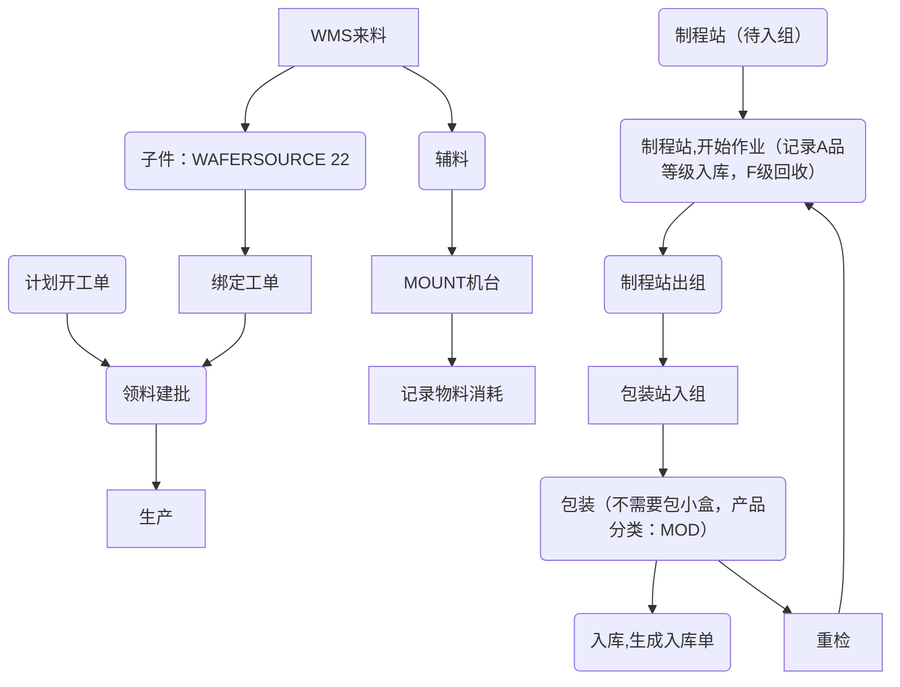
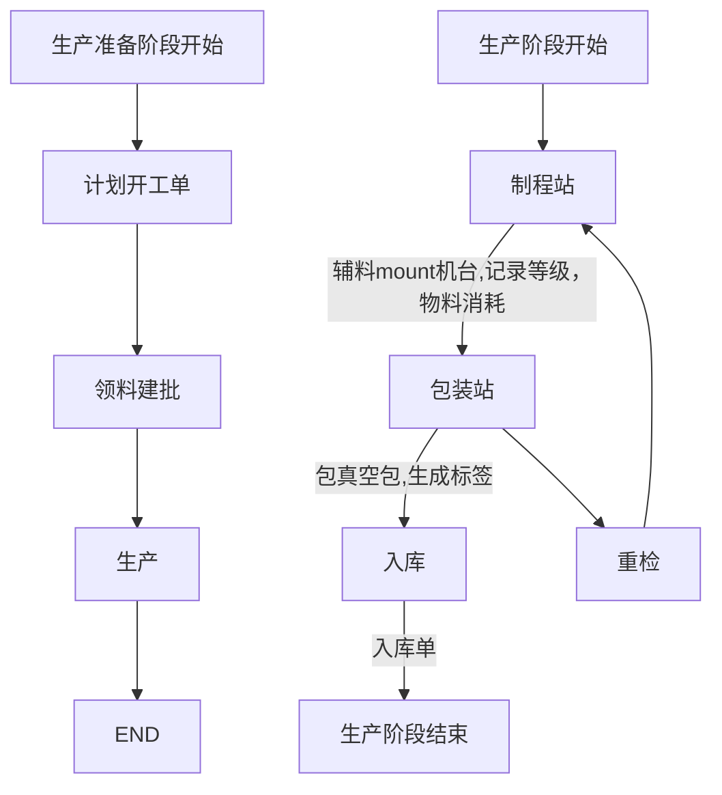

# 模组流程图

```mermaid
graph TB
	DD(计划开工单)-->Q(领料建批)-->生产
		WMS来料-->T(子件：WAFERSOURCE 22)-->绑定工单-->Q
		WMS来料-->TT(辅料)-->MOUNT机台-->记录物料消耗


	A(制程站（待入组）)-->AA(制程站,开始作业（记录A品等级入库，F级回收）)-->B(制程站出组)-->包装站入组-->BB(包装（不需要包小盒，产品分类：MOD）)-->CC(入库,生成入库单)
		BB-->重检-->AA

```

```mermaid
graph TB

	生产准备阶段开始-->计划开工单-->领料建批-->生产-->END

	生产阶段开始-->制程站--辅料mount机台,记录等级，物料消耗-->包装站--包真空包,生成标签-->入库--入库单-->生产阶段结束
	包装站-->重检-->制程站

```

1. 是否需要抽真空，真空检验，烘烤，是否需要打回重测
2. 进程站是否需要合批次，是否需要缺陷损耗记录

（工单类型：11）
