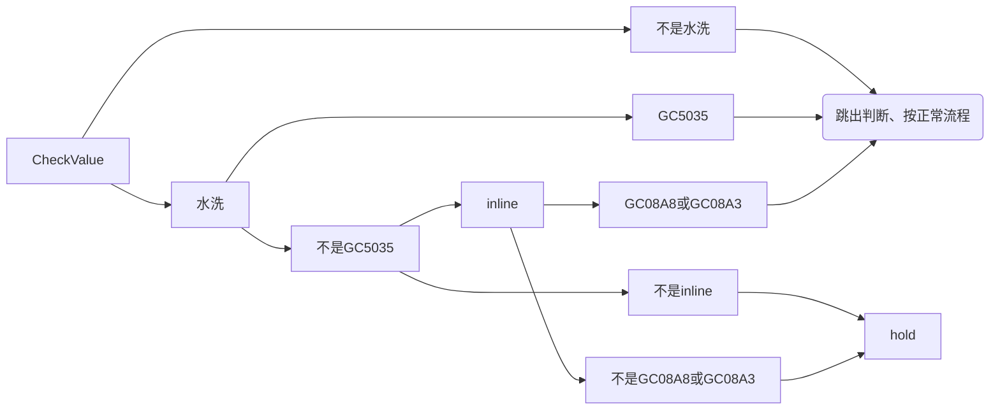

# 晶圆型号下拉

```js
StringBuilder sqlb = new StringBuilder("SELECT A.DEVICE ");  
sqlb.append(" FROM BACKEND_WAFER_RECEIVE a  ");  
sqlb.append(" WHERE 1=1");  
if (StringUtils.isNotEmpty(cstId)) {  
    sqlb.append("  AND a.CST_ID ='").append(cstId).append("'");  
}  
if (StringUtils.isNotEmpty(status)) {  
    sqlb.append("  AND a.STATUS ='").append(status).append("'");  
}  
sqlb.append(" GROUP BY A.DEVICE ");
```

# 查询

## 1.根据文本框条件查询符合的晶圆

```js
getWaferInfoListByStatus(cstId,waferId,device,version,facilityRrn,WaferReceive.STATUS_WAITP,null);

SqlBuilder sqlBuilder = getSqlBuilder().select(columnNames).from(tableName).where("FACILITY_RRN").eq(facilityRrn);  
if (StringUtils.isNotEmpty(cstId)) {  
   sqlBuilder.and(" CST_ID ").eq(cstId);  
}  
if (StringUtils.isNotEmpty(waferId)) {  
   sqlBuilder.and(" WAFER_ID ").eq(waferId);  
}   
if (StringUtils.isNotEmpty(device)) {  
   sqlBuilder.and(" DEVICE ").eq(device);  
}   
if (StringUtils.isNotEmpty(version)) {  
   sqlBuilder.and(" VERSION ").eq(version);  
}  
if (StringUtils.isNotEmpty(status)){  
   sqlBuilder.and(" STATUS ").eq(status);  
}  
if (StringUtils.isNotEmpty(waferSource)){  
   sqlBuilder.and(" WAFER_SOURCE ").eq(waferSource);  
}  
sqlBuilder.orderBy("WAFER_ID");
```

## 2.为查询到的晶圆赋

### 查询getRelationsByFromRrnAndLinkType，获取晶圆处理进
```
SqlBuilder sqlBuilder =  getSqlBuilder().select(columnNames).from(tableName)  
      .where(" from_rrn ").eq(fromRrn);  
if(StringUtils.isNotEmpty(linkType)){  
   sqlBuilder.and(" link_type ").eq(linkType);  
}
```
### 增加工单备注

```js
for (WaferReceive waferReceive : waferList) {  
   List<ProcessRelation> rList = toolService.getRelationsByFromRrnAndLinkType(null, waferReceive.getObjectRrn());  
   if(CollectionUtils.isNotEmpty(rList)){  
      waferReceive.setProcessProgress(refdlist.get(rList.size()-1).getData1Value());  
   }  
   if (StringUtils.isNotEmpty(waferReceive.getWorkorderId())) {  
      WorkOrder w = prpSetupService.getWorkOrderById(waferReceive.getWorkorderId());  
      if (w != null) {  
         waferReceive.setWorkOrderRemark(w.getComments());  
      }  
   }  
}
```

# 晶圆处理

## 判断所选晶圆进度是否一

```js
int processProgress = -1;  
for (WaferReceive wr : waferl) {  
   List<ProcessRelation> rList = toolService.getRelationsByFromRrnAndLinkType(null, wr.getObjectRrn());  
   if(processProgress != -1 && processProgress != rList.size()){  
      throw new MyCimException(ToolExceptions.WAFER_IN_CHOOSE_HAVE_DIFFERENT_SCHEDULE);  
   }  
   processProgress = rList.size();  
}
```

## 卡控型号水洗

### 水洗自动化过站接

[[WAFER自动水洗过站|WAFER自动水洗过站]]



```java
if (StringUtils.equals(theform.getCheckValue(), "水洗")) {  
   if (!wr.getDevice().startsWith("GC5035")) {  
      WorkOrder w = prpSetupService.getWorkOrderById(wr.getWorkorderId());  
      if (!StringUtils.equals(w.getComLineType(), "9")  
            || (!wr.getDevice().startsWith("GC08A8") && !wr.getDevice().startsWith("GC08A3"))) {  
         throw new MyCimException("未查询到wafer清洗信息，不允许过站");  
      }  
   }  
}
```
