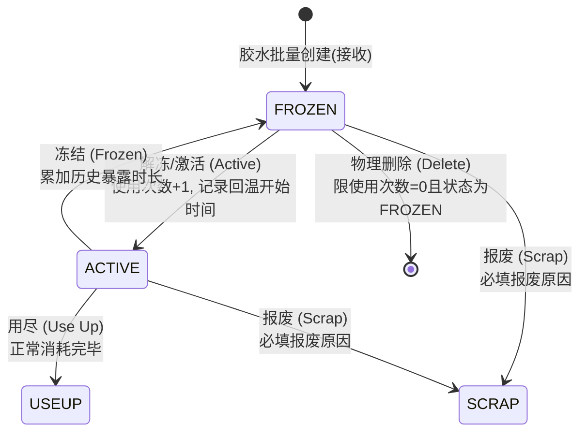

# 胶水处理与生命周期状态管控

## 1. 业务背景与概述

在半导体封测生产制造流程中，胶水（GLUE）作为关键直接辅料，其全生命周期流转状态直接影响到封装工艺质量及生产追溯。

系统通过 **胶水处理（Glue Overview）** 模块（`/mycim2/glueOverview.do`）为产线操作员及物料管理人员提供胶水流转的核心操作入口（包括解冻回温、中途冻结、脱泡标记、用尽、报废、标签打印与物理删除等）。

为防止已终结生命周期（已报废、已用尽）的胶水记录干扰日常作业，系统在**胶水处理主列表查询**以及各业务模块的**胶水放大镜过滤查询弹窗**中，建立了自动过滤排除机制。

---

## 2. 胶水生命周期与状态机

### 2.1 状态定义

| 状态代码 (`STATUS`) | 业务名称 | 说明 | 参与日常处理 |
| :--- | :--- | :--- | :--- |
| `FROZEN` | **冻结 / 冷冻** | 胶水初始入库状态，或未用完临时放回冷柜状态。处于冻结状态时暴露时效暂停累计。 | ✅ 是 |
| `ACTIVE` | **激活 / 解冻回温** | 胶水从冷柜取出进行回温并投入使用。系统记录本次回温开始时间并累计使用次数。 | ✅ 是 |
| `USEUP` | **用尽** | 胶水在机台正常使用消耗完毕，生命周期正常终结。 | ❌ 否（自动过滤） |
| `SCRAP` | **报废** | 胶水因过期、时效超限、脱泡不良或品质异常被报废，生命周期非正常终结。 | ❌ 否（自动过滤） |
| `RETURN` | **退仓库** | 胶水退回原材料仓库。 | ❌ 否 |

### 2.2 状态流转状态机



---

## 3. 胶水处理操作功能说明

胶水处理前端界面位于 `app/tools/glueOverview/glueOverview.jsp`，提供以下关键操作：

| 操作按钮 | 接口 Action | 前置业务校验与卡控 | 处理逻辑说明 |
| :--- | :--- | :--- | :--- |
| **查询 (Query)** | `action=query` | 至少需输入胶水号或胶水类型号之一 | **排除已报废(`SCRAP`)与已用尽(`USEUP`)胶水**，仅展示在途可流转胶水。 |
| **解冻 (Active)** | `action=active` | 需单选一条胶水记录 | 状态变更为 `ACTIVE`，当前使用次数加 1（`CURRENT_USED_COUNT + 1`），记录 `TEMPERATURE_START_TIME`。 |
| **冻结 (Frozen)** | `action=frozen` | 需单选一条胶水记录 | 状态变更为 `FROZEN`，计算本次暴露时间并累加至 `TOTAL_USAGE_TIME`。 |
| **脱泡 (Defoaming)** | `action=defoamingMark`| 需单选一条胶水记录 | 打上脱泡标记（`DEFOAMING_MARK=1`、`DEFOAMING_FLAG=1`），满足上料机台脱泡前置要求。 |
| **用尽 (Useup)** | `action=useup` | 需单选一条胶水记录 | 状态变更为 `USEUP`，胶水生命周期结束，自动从胶水处理列表中移除。 |
| **报废 (Scrap)** | `action=scrap` | 需单选一条记录，且**必须选择报废原因(`actionReason`)** | 状态变更为 `SCRAP`，记录报废原因与说明，生命周期结束，自动从列表中移除。 |
| **删除 (Delete)** | `action=doGlueDelete` | **硬卡控**：只有状态为 `FROZEN` 且使用次数为 0 的胶水才允许删除 | 从数据库物理删除（`glueRepository.deleteOneById`），用于新建胶水错误时的作废。 |
| **标签打印** | `action=labelPrint` | 需单选一条记录 | 调用 BarTender ActiveX 打印“胶水管控标签.btw”，输出胶水号、类型、生产日期及有效日期。 |

---

## 4. 报废与用尽胶水过滤机制

### 4.1 业务需求与动因
- **处理界面轻量化**：产线日常维护胶水时，只关心仍在冷柜（`FROZEN`）或在线回温使用（`ACTIVE`）的批次；大量的历史 `USEUP` 和 `SCRAP` 记录混杂会严重影响操作效率与误选几率；
- **弹窗过滤防错**：在机台上料（Glue Mount）或工单投料等场景下，点击胶水号搜索放大镜弹窗时，严禁误选已报废或已用尽的胶水。

### 4.2 过滤逻辑实现细节

#### 1) 胶水处理模块后端 SQL 过滤
- **文件**：`com.mycim.tool.service.impl.GlueServiceImpl.java`
- **方法**：`getGuleListByGlueIdAndGlueTypeId(...)`
- **代码实现**：
  ```java
  String sql = "SELECT T.OBJECT_RRN, T.FACILITY_RRN, T.NAME, T.STATUS, ... " +
               "FROM TOOL_GLUE T LEFT JOIN EQUIPMENT_MATERIAL E ON T.NAME=E.MATERIAL_LOT_ID WHERE 1=1";
  if (StringUtils.isNotBlank(glueId)) {
      sql += " AND T.NAME='" + glueId + "'";
  }
  if (StringUtils.isNotBlank(glueTypeId)) {
      sql += " AND T.GLUE_TYPE='" + glueTypeId + "'";
  }
  // 核心过滤：排除报废与用尽状态胶水
  sql += " AND (T.STATUS NOT IN ('" + Glue.STATUS_SCRAP + "', '" + Glue.STATUS_USEUP + "') OR T.STATUS IS NULL) ";
  sql += " order by T.EFFECTIVE_DATE DESC, T.OBJECT_RRN DESC ";
  ```

#### 2) 底层仓储层同步过滤
- **文件**：`com.mycim.tool.repository.impl.GlueRepositoryImpl.java`
- **方法**：`getListByGlueIdAndGlueTypeId(...)`
- **代码实现**：
  ```java
  sqlBuilder.and(" (STATUS NOT IN ('" + Glue.STATUS_SCRAP + "', '" + Glue.STATUS_USEUP + "') OR STATUS IS NULL) ");
  ```

#### 3) 全局搜索放大镜弹窗过滤
- **文件**：`core/web/typeDefinitions.jsp`
- **配置项**：`GLUE_ID`（胶水号）与 `GLUE_LOT_ID`（胶水批次号）
- **代码实现**：
  ```jsp
  } else if (type.equalsIgnoreCase("GLUE_ID")) {
      columns = "NAME";
      tableID = "TOOL_GLUE";
      strWhere = "(STATUS NOT IN ('SCRAP', 'USEUP') OR STATUS IS NULL)"; 
      labels = new String[1];
      labels[0] = "LBS_GLUE_ID";
      keyColumn = "NAME";
  } else if (type.equalsIgnoreCase("GLUE_LOT_ID")) {
      columns = "NAME";
      tableID = "TOOL_GLUE";
      strWhere = "(STATUS NOT IN ('SCRAP', 'USEUP') OR STATUS IS NULL)";
      labels = new String[1];
      labels[0] = "LBL_GLUEMOUNT_GLUELOTID";
      keyColumn = "NAME";
  }
  ```

---

## 5. 常见问题与排查指南

### Q1: 胶水报废或用尽后，在哪里可以追溯查看其历史？
- **解答**：转至 **胶水历史查询（Glue History）** 模块（`/mycim2/glueHistory.do`）。该模块直接针对 `TOOL_GLUE_HISTORY` 表进行时序追踪，不受列表过滤影响，可完整查看该胶水从入库、回温、冻结到报废/用尽的全过程交易事务及操作人、时间与备注。

### Q2: 为什么某些胶水点击【删除】会提示失败？
- **解答**：系统严格卡控物理删除条件：`FID_GLUE_CAN_NOT_DELETE = "只有状态为FROZEN且当前使用次数为零的胶水可以删除"`。
  - 若胶水已经激活使用过（`currentUsedCount > 0`）或状态非 `FROZEN`，不允许直接删除，必须走【报废（Scrap）】流程，确保审计追溯链条完整。

---

## 6. 详细更新记录

### [2026-09-09] 胶水处理与过滤查询排除报废和用尽胶水

- **需求人**：-
- **需求 / 背景**：
  - 在“胶水处理”业务模块（`glueOverview`）以及系统全局的胶水输入放大镜“过滤查询”弹窗（`typeDefinitions.jsp` 中的 `GLUE_ID` 与 `GLUE_LOT_ID`）中，原查询逻辑未对胶水状态进行约束，导致已报废（`SCRAP`）与已用尽（`USEUP`）的终结状态胶水被查出并展示；
  - 业务上已报废和用尽的胶水属于已归档/终结物料，不应再参与胶水日常处理（如解冻、冻结、脱泡等）或出现在机台上料与投料待选列表中；
  - 需对胶水列表查询及放大镜过滤查询统一增加状态卡控，排除 `SCRAP` 和 `USEUP` 状态。
- **核心代码改动**：
  - `GlueServiceImpl.java`：
    - 在 `getGuleListByGlueIdAndGlueTypeId` 构建的查询 SQL 中增加状态过滤条件：`AND (T.STATUS NOT IN ('SCRAP', 'USEUP') OR T.STATUS IS NULL)`，查询时自动排除报废和用尽胶水；
  - `GlueRepositoryImpl.java`：
    - 在 `getListByGlueIdAndGlueTypeId` 方法中，在 `SqlBuilder` 中同步增加 `(STATUS NOT IN ('SCRAP', 'USEUP') OR STATUS IS NULL)` 过滤条件，保持仓储层逻辑一致；
  - `typeDefinitions.jsp`：
    - 将 `GLUE_ID`（胶水号检索）与 `GLUE_LOT_ID`（胶水批次号检索）的 `strWhere` 配置由 `"1=1"` 调整为 `"(STATUS NOT IN ('SCRAP', 'USEUP') OR STATUS IS NULL)"`，使弹出检索框自动排除报废与用尽胶水。
- **数据库变动 (SQL)**：
  - 无（仅更新应用层 SQL 查询条件）。
- **配置与部署注意**：
  - 重新编译打包 `tool.jar` 并部署对应类；
  - 胶水历史事务查询模块（`glueHistory`）保留全状态历史追溯能力，不受本次列表过滤影响。
- **自测情况**：
  - 编译构建验证：执行 `ant jar.tool` 成功生成 `tool.jar`；
  - 胶水处理界面按胶水号或胶水类型号查询，报废和用尽胶水不再显示；
  - 胶水号右侧放大镜弹窗过滤检索，报废和用尽胶水不再被列出。

