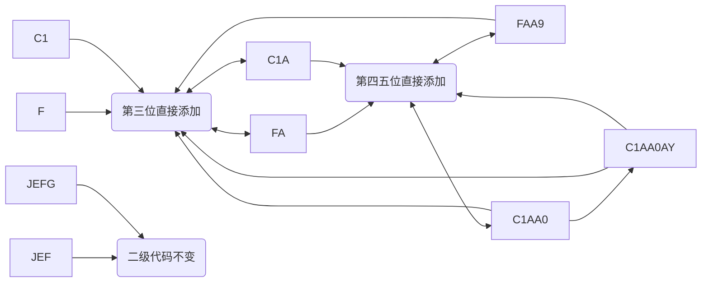

# COM 二级代码规则配置

## 需求背景

### 2023-08-11 会议沟通

1. 第 3 码：在 COM 与 ATE 测试程序一览中增加第三位二级代码配置，批次过 `CATE` 站点时补入第 3 码。
2. 第 4 码与 Route 关系：批次过 `CATE` 站点时补入第 4 码。
3. 第 5 码：小盒包装时根据等级赋值；不良品按不良品规则处理。
4. 在 `CATE`、`CFVI`、`CAOI` 站点对批次出站等级做卡控。良品等级包括 `TA0`、`TA1`、`CA`、`IA`、`JA`、`KA`、`LA`、`EA`、`EA8`，其余视为不良品等级。
5. 等级对应的第 5 位二级代码如下：

| 等级 | 对应第 5 位 |
| --- | --- |
| TA0 | 0 |
| TA1 | 1 |
| CA | 0 |
| IA | 0 |
| JA | 0 |
| KA | 0 |
| LA | 0 |
| EA | 1 |
| EA8 | 1 |

6. 真空包包装时，根据 Route 和当前等级转换为入库等级，规则如下：


| Route | Wafer 类型 | 入库等级 |
| --- | --- | --- |
| `COM_B/F_WAFER_CATE` | F 级 Wafer | `R` |
| `COM_CJ_WAFER_CATE_CAOI` | 拆解回收 | `J` |
| `COM_FR0_WAFER_CATE` | F 级 Wafer | `P` |
| 其他 | 正常 Wafer | `A` |

7. 真空包标签 `Subcode` 栏位中展示入库等级。
8. 批次过站结束作业时，等级界面展示 `BinGroup` 定义描述。
9. 等级展示顺序固定为 `TA0`、`TA1`、`CA`、`IA`、`JA`、`KA`、`LA`、`EA`、`EA8`，其他等级排在后面。



## 编写代码

### 判断是否走新规则二级代码

满足以下条件时，按新规则处理二级代码：

1. 工单创建时间晚于新规则生效时间。
2. 二级代码长度为 `1` 或 `2`。
3. 二级代码长度为 `3`，且与工单二级代码不一致。
4. 二级代码长度为 `4` 或 `5`，且最后一位为数字。
5. 二级代码长度为 `7`，且最后两位为 `AA` 或 `AY`，倒数第三位为数字。

```java
if (date.before(createTime) && StringUtils.isNotEmpty(lotLevelTwoCode)) {
    if (lotLevelTwoCode.length() == 1 || lotLevelTwoCode.length() == 2) {
        return lotLevelTwoCode.length();
    } else if (lotLevelTwoCode.length() == 3
            && !StringUtils.equals(workOrder.getLevelTwoCode(), lotLevelTwoCode)) {
        return lotLevelTwoCode.length();
    } else if (lotLevelTwoCode.length() == 4 || lotLevelTwoCode.length() == 5) {
        char lastChar = lotLevelTwoCode.charAt(lotLevelTwoCode.length() - 1);
        if (Character.isDigit(lastChar)) {
            return lotLevelTwoCode.length();
        }
    } else if (lotLevelTwoCode.length() == 7) {
        char lastChar = lotLevelTwoCode.charAt(lotLevelTwoCode.length() - 3);
        if (Character.isDigit(lastChar)
                && (lotLevelTwoCode.endsWith("AA") || lotLevelTwoCode.endsWith("AY"))) {
            return lotLevelTwoCode.length();
        }
    }
}
```

> [!NOTE]
> 下文提到的“二级代码长度”，默认都指通过上述方法筛选后、符合新规则的二级代码长度。

### 测试位（第三位）

涉及文件：`ProcessSwitchAction.java`

在 COM 与 ATE 测试程序一览中增加第三位二级代码配置，批次过 `CATE` 站点时增加第 3 位二级代码。


#### 卡控出站等级

```java
private void controlGrade(Lot lot, List<LotDieBin> controlList) {

    // 等级出站卡控
    String operationId = baseService.getNamedObjectId(lot.getOperationRrn());
    String workOrderId = lot.getOuterOrderNO();
    List<String> steps = Arrays.asList(Operation.OPERATION_CATE, Lot.CFVI, Lot.CAOI, Lot.CWVI);
    String binTA0 = "TA0";
    String binF = "F";
    String bin = "HA5";

    LotExt lotExt = getLotExtByLotRrn(lot.getLotRrn());
    if (prpSetupService.judgeLevelTwoCodeRules(workOrderId, lotExt.getLevelTwoCode()) > 0
            && steps.contains(operationId)) {
        // COM 二级代码变更需求上线后，工单拆解返修批次：原良品入 HA5，改为良品入 TA0，不良入 F
        bin = binTA0;
        WorkOrder workOrder = prpSetupService.getWorkOrderById(workOrderId);
        if (StringUtils.equals(operationId, Operation.OPERATION_CATE)
                || lotExt.getLevelTwoCode().length() > 2
                || !StringUtils.equals(lotExt.getLevelTwoCode(), workOrder.getLevelTwoCode())) {
            for (LotDieBin lotDieBin : controlList) {
                if (lotDieBin.getUnpackedQty() > 0
                        && StringUtils.equals(lotDieBin.getBinType(), LotDieBin.GOOD)
                        && !LotDieBin.orders.contains(lotDieBin.getBinId())) {
                    throw new MyCimException("良品等级仅允许 TA0、TA1、CA、IA、JA、KA、LA、EA、EA8");
                }
            }
        }
    } else if (prpSetupService.judgeLevelTwoCodeRules(workOrderId, lotExt.getLevelTwoCode()) <= 0) {
        for (LotDieBin lotDieBin : controlList) {
            if (lotDieBin.getUnpackedQty() > 0
                    && (StringUtils.equals(lotDieBin.getBinId(), "TA0")
                    || StringUtils.equals(lotDieBin.getBinId(), "TA1"))) {
                throw new MyCimException("旧工单不能选择 TA0、TA1 等级（Old work orders cannot select TA0, TA1 levels）");
            }
        }
    }

    if (Operation.OPERATION_CATE.equals(operationId)
            && CollectionUtils.isNotEmpty(getComReworkLot(lot.getLotId()))) {
        for (LotDieBin lotDieBin : controlList) {
            if (lotDieBin.getUnpackedQty() > 0
                    && (!StringUtils.equals(lotDieBin.getBinId(), bin)
                    || !StringUtils.equals(lotDieBin.getBinId(), binF))) {
                throw new MyCimException("拆解返修批次出站等级：良品入#" + bin + "，不良品入#" + binF);
            }
        }
    }
}
```

#### 更新第三位二级代码

更新逻辑会根据二级代码长度分支处理：

1. 获取第三位测试码；如果第三位测试码为空，则先 `hold` 批次。
2. 长度为 `7`、`5`、`4` 时，按规则替换对应位置。
3. 长度为 `5` 时，如果满足 `GC08A8` 条件，还会追加 `AA` 或 `AY` 后缀。
4. 长度为 `3` 或特定 `2` 位场景时，替换末位。
5. 长度为 `1` 或 `2` 时，直接追加第三位。

```java
if (StringUtils.equals(codeType, "CODE3") && len > 0) {
    String thirdComCode = getTheThirdComCode(workOrder.getWorkorderId(), tempCode);
    if (StringUtils.equals(thirdComCode, "1")) {
        return "1";
    }
    if (len == 7) {
        levelTwoCode = levelTwoCode.substring(0, 2) + thirdComCode + levelTwoCode.substring(3);
    } else if (len == 5) {
        levelTwoCode = levelTwoCode.substring(0, 2) + thirdComCode + levelTwoCode.substring(3);
        String version = getVersionByWorkOrder(workOrder.getWorkorderId());
        String prefix = WaferBindByGC08A8(version, workOrder.getProductId());
        if (StringUtils.isNotEmpty(prefix) && !StringUtils.equals(prefix, "ERROR")) {
            levelTwoCode = levelTwoCode + prefix;
        }
    } else if (len == 4) {
        levelTwoCode = levelTwoCode.substring(0, 1) + thirdComCode + levelTwoCode.substring(2);
    } else if (len == 3
            || (len == 2 && !StringUtils.equals(workOrder.getLevelTwoCode(), levelTwoCode))) {
        levelTwoCode = levelTwoCode.substring(0, len - 1) + thirdComCode;
    } else if (len == 1 || len == 2) {
        levelTwoCode = levelTwoCode + thirdComCode;
    }
}
```

### 第四位和第五位


处理原则：

1. 长度为 `7`、`5`、`4` 时，替换第四、第五位。
2. 长度为 `5` 或 `3`，且满足 `GC08A8` 条件时，追加 `AA` 或 `AY` 后缀。
3. 长度为 `2` 且与工单二级代码不一致时，补上第四、第五位。

```java
String endCode = getTheFourthComCode(workOrder.getWaferLevel()) + getTheFifthComCode(tempCode);
if (len == 7) {
    levelTwoCode = levelTwoCode.substring(0, len - 4) + endCode + levelTwoCode.substring(len - 2);
} else if (len == 5) {
    levelTwoCode = levelTwoCode.substring(0, len - 2) + endCode;
    String version = getVersionByWorkOrder(workOrder.getWorkorderId());
    String prefix = WaferBindByGC08A8(version, workOrder.getProductId());
    if (StringUtils.isNotEmpty(prefix) && !StringUtils.equals(prefix, "ERROR")) {
        levelTwoCode = levelTwoCode + prefix;
    }
} else if (len == 4) {
    levelTwoCode = levelTwoCode.substring(0, len - 2) + endCode;
} else if (len == 3) {
    levelTwoCode = levelTwoCode + endCode;
    String version = getVersionByWorkOrder(workOrder.getWorkorderId());
    String prefix = WaferBindByGC08A8(version, workOrder.getProductId());
    if (StringUtils.isNotEmpty(prefix) && !StringUtils.equals(prefix, "ERROR")) {
        levelTwoCode = levelTwoCode + prefix;
    }
} else if (len == 2 && !StringUtils.equals(workOrder.getLevelTwoCode(), levelTwoCode)) {
    levelTwoCode = levelTwoCode + endCode;
}
```

### 入库等级


当前只有 `TA0` 和 `TA1` 等级会走入库等级转换。

```java
List<ComTwoLevelCodeConfig> configs = new ArrayList<>();

ComTwoLevelCodeConfig config = new ComTwoLevelCodeConfig();
// 入库等级
config.setType(ComTwoLevelCodeConfig.STORAGE_GRADE);

if (StringUtils.equals("TA0", grade) || StringUtils.equals("TA1", grade)) {
    config.setGrade(grade);
    config.setWaferType(waferLevel);
    configs = queryComTwoLevelCodeConfig(config);
    if (!configs.isEmpty()) {
        return configs.get(0).getStorageGrade();
    } else {
        throw new MyCimParameterException(
                "联系工程师配置 wafer等级：" + waferLevel + "，等级：" + grade + " 的入库等级");
    }
}
return grade;
```

### 包装 Subcode

规则说明：

1. 长度为 `7` 时，直接返回二级代码。
2. 长度为 `4` 或 `5` 时，调用 `generateRandomLevelTwoCode` 生成混码。
3. 其他场景返回 `二级代码 + 等级`。

```java
if (len == 7) {
    packedLotJson.put("subcode", packedLot.getLevelTwoCode());
} else if (len == 4 || len == 5) {
    packedLotJson.put("subcode", generateRandomLevelTwoCode(packedLot));
} else {
    packedLotJson.put("subcode", packedLot.getLevelTwoCode() + packedLot.getGrade());
}
```

```java
String levelTwoCode = packedLot.getLevelTwoCode();
if (StringUtils.isNotEmpty(levelTwoCode)) {
    char lastChar = levelTwoCode.charAt(levelTwoCode.length() - 1);
    if (Character.isDigit(lastChar)) {
        if (Character.compare(lastChar, '8') == 0 || Character.compare(lastChar, '9') == 0) {
            levelTwoCode = levelTwoCode + "-" + packedLot.getGrade();
        } else {
            StringBuffer randomString = new StringBuffer();
            for (int i = 0; i < 3; i++) {
                int randomIndex = new Random().nextInt(6) + 2;
                randomString.append(randomIndex);
            }
            int randomIndex = new Random().nextInt(3);
            randomString.setCharAt(randomIndex, lastChar);
            levelTwoCode = levelTwoCode.substring(0, levelTwoCode.length() - 1)
                    + randomString.toString();
        }
    }
}
```

## 源码

```java
@Override
public Integer judgeLevelTwoCodeRules(String workOrderId, String lotLevelTwoCode) throws MyCimException {
    try {
        WorkOrder workOrder = getWorkOrderById(workOrderId);
        if (!StringUtils.equals(workOrder.getProductClassify(), WorkOrder.COM)) {
            return 0;
        }
        List<WorkOrderHistory> historyList = getWorkOrderHistoryByWorkOrderId(workOrderId);
        if (!historyList.isEmpty()) {
            SimpleDateFormat format = new SimpleDateFormat("yyyy/MM/dd HH:mm:ss");
            Date createTime = format.parse(historyList.get(historyList.size() - 1).getTransTime());
            Date date = new SimpleDateFormat("yyyy-MM-dd HH:mm:ss").parse("2024-04-15 11:00:00");
            if (date.before(createTime) && StringUtils.isNotEmpty(lotLevelTwoCode)) {
                if (lotLevelTwoCode.length() == 1 || lotLevelTwoCode.length() == 2) {
                    return lotLevelTwoCode.length();
                } else if (lotLevelTwoCode.length() == 3
                        && !StringUtils.equals(workOrder.getLevelTwoCode(), lotLevelTwoCode)) {
                    return lotLevelTwoCode.length();
                } else if (lotLevelTwoCode.length() == 4 || lotLevelTwoCode.length() == 5) {
                    char lastChar = lotLevelTwoCode.charAt(lotLevelTwoCode.length() - 1);
                    if (Character.isDigit(lastChar)) {
                        return lotLevelTwoCode.length();
                    }
                } else if (lotLevelTwoCode.length() == 7) {
                    char lastChar = lotLevelTwoCode.charAt(lotLevelTwoCode.length() - 3);
                    if (Character.isDigit(lastChar)
                            && (lotLevelTwoCode.endsWith("AA") || lotLevelTwoCode.endsWith("AY"))) {
                        return lotLevelTwoCode.length();
                    }
                }
            }
        }
        return 0;
    } catch (Exception exception) {
        throw ExceptionHandler.handlerException(exception, logger);
    }
}

@Override
public String generateLevelCode(WorkOrder workOrder, String levelTwoCode, String tempCode, String codeType) {
    try {
        int len = judgeLevelTwoCodeRules(workOrder.getWorkorderId(), levelTwoCode);
        if (StringUtils.equals(codeType, "CODE3") && len > 0) {
            String thirdComCode = getTheThirdComCode(workOrder.getWorkorderId(), tempCode);
            if (StringUtils.equals(thirdComCode, "1")) {
                return "1";
            }
            if (len == 7) {
                levelTwoCode = levelTwoCode.substring(0, 2) + thirdComCode + levelTwoCode.substring(3);
            } else if (len == 5) {
                levelTwoCode = levelTwoCode.substring(0, 2) + thirdComCode + levelTwoCode.substring(3);
                String version = getVersionByWorkOrder(workOrder.getWorkorderId());
                String prefix = WaferBindByGC08A8(version, workOrder.getProductId());
                if (StringUtils.isNotEmpty(prefix) && !StringUtils.equals(prefix, "ERROR")) {
                    levelTwoCode = levelTwoCode + prefix;
                }
            } else if (len == 4) {
                levelTwoCode = levelTwoCode.substring(0, 1) + thirdComCode + levelTwoCode.substring(2);
            } else if (len == 3
                    || (len == 2 && !StringUtils.equals(workOrder.getLevelTwoCode(), levelTwoCode))) {
                levelTwoCode = levelTwoCode.substring(0, len - 1) + thirdComCode;
            } else if (len == 1 || len == 2) {
                levelTwoCode = levelTwoCode + thirdComCode;
            }
        } else if (StringUtils.equals(codeType, "CODE45")) {
            if (len >= 2) {
                String endCode = getTheFourthComCode(workOrder.getWaferLevel())
                        + getTheFifthComCode(tempCode);
                if (len == 7) {
                    levelTwoCode = levelTwoCode.substring(0, len - 4) + endCode
                            + levelTwoCode.substring(len - 2);
                } else if (len == 5) {
                    levelTwoCode = levelTwoCode.substring(0, len - 2) + endCode;
                    String version = getVersionByWorkOrder(workOrder.getWorkorderId());
                    String prefix = WaferBindByGC08A8(version, workOrder.getProductId());
                    if (StringUtils.isNotEmpty(prefix) && !StringUtils.equals(prefix, "ERROR")) {
                        levelTwoCode = levelTwoCode + prefix;
                    }
                } else if (len == 4) {
                    levelTwoCode = levelTwoCode.substring(0, len - 2) + endCode;
                } else if (len == 3) {
                    levelTwoCode = levelTwoCode + endCode;
                    String version = getVersionByWorkOrder(workOrder.getWorkorderId());
                    String prefix = WaferBindByGC08A8(version, workOrder.getProductId());
                    if (StringUtils.isNotEmpty(prefix) && !StringUtils.equals(prefix, "ERROR")) {
                        levelTwoCode = levelTwoCode + prefix;
                    }
                } else if (len == 2
                        && !StringUtils.equals(workOrder.getLevelTwoCode(), levelTwoCode)) {
                    levelTwoCode = levelTwoCode + endCode;
                }
            }
        }
        return levelTwoCode;
    } catch (Exception exception) {
        throw ExceptionHandler.handlerException(exception, logger);
    }
}
```
