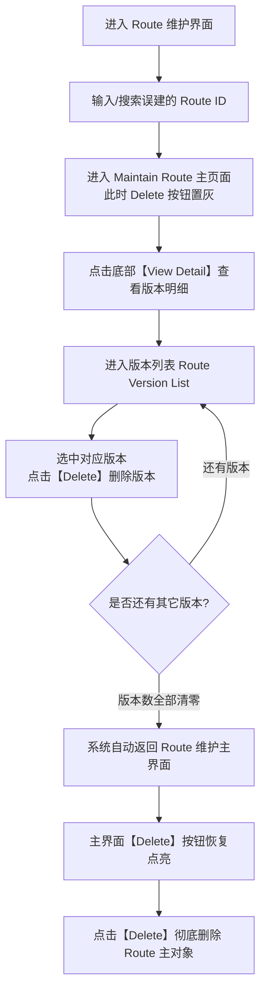

# 工艺流程 Route 与 Process 区别及删除指南

## 1. 业务背景与问题概述

在半导体 MES（MyCIM2）系统运维与工艺配置过程中，常有用户出现以下误操作与疑问：
- **误操作现象**：本意是为新产品配置一套 **主流程（Process ID）**，但在系统菜单中误进入了 **Route 维护（工艺路径）** 界面并点击新增；
- **引发问题**：创建后发现无法在【工单生产/排产】、【产品定义（Product Process）】或批次投批时选到该流程号；
- **删除困惑**：返回 Route 维护界面试图删除时，发现页面底部的 **【Delete】（删除）按钮是灰色的（置灰禁用）**，不知道如何将其清理。

本文档详细说明 Process 与 Route 的核心区别、前台删除卡点原理、标准删除操作 SOP 以及数据库应急清理方案。

---

## 2. Process（主流程）与 Route（子流程）核心区别

在 SEMI 标准与 MyCIM2 系统架构中，工艺流程采用层级化组织：
$$\text{Process (主流程/Process ID)} \longrightarrow \text{Route (子流程/工艺段)} \longrightarrow \text{Operation (工序/站点)} \longrightarrow \text{Recipe (机台程序)}$$

### 2.1 业务定位对比

| 维度 | Process（主流程 / Process ID） | Route（子流程 / 工艺路径） |
| :--- | :--- | :--- |
| **层级定位** | 最高层级工作流，代表一个产品完整的端到端工艺加工流程 | 中间层级工作流，代表一组工步的逻辑组合或局部工艺段 |
| **业务用途** | 绑定工单（Work Order）、产品（Product）、用于在制批次（Lot）投批流转 | 被 Process 引用与组装；多个 Process 可复用同一个 Route |
| **系统前台入口** | `PRP -> 工艺规划 / 流程定义`（或快速搜索 `technology`） | `PRP -> 工艺管理 -> Route 维护`（或快速搜索 `route`） |
| **对应 Action** | `/mycim2/technologyedit.do` / `/mycim2/technologysave.do` | `/mycim2/routeedit.do` / `/mycim2/routesave.do` |

### 2.2 底层数据模型对比

在 Oracle 数据库底层，两者均记录在通用对象管理表 `NAMED_OBJECT` 中，但通过 **`OBJECT_SUBTYPE`** 字段严格区分：

```sql
-- 1. 主流程（Process ID）的数据定义特征
SELECT INSTANCE_RRN, INSTANCE_ID, OBJECT, OBJECT_TYPE, OBJECT_SUBTYPE
FROM NAMED_OBJECT
WHERE OBJECT = 'WFL' 
  AND OBJECT_TYPE = 'ROUTE' 
  AND OBJECT_SUBTYPE = 'PROCESS';   -- ★ 核心标记：PROCESS

-- 2. 子流程（Route）的数据定义特征
SELECT INSTANCE_RRN, INSTANCE_ID, OBJECT, OBJECT_TYPE, OBJECT_SUBTYPE
FROM NAMED_OBJECT
WHERE OBJECT = 'WFL' 
  AND OBJECT_TYPE = 'ROUTE' 
  AND OBJECT_SUBTYPE = 'PROCEDURE'; -- ★ 核心标记：PROCEDURE
```

> [!IMPORTANT]
> 工单排产和产品定义关联校验时，后台 SQL 会强制过滤 `OBJECT_SUBTYPE = 'PROCESS'`。如果在 Route 维护界面创建，系统自动赋子类型为 `PROCEDURE`，因此工单系统绝对识别不到它作为主流程。

---

## 3. 为什么 Route 界面删除按钮置灰？（源码机制）

很多用户误建 Route 后，在维护主界面找不到删除方式，这是因为 MyCIM2 框架的**对象级联保护机制**。

### 3.1 核心代码逻辑解析

在后端控制层 [PrpSetupAction.java](file:///c:/Users/A0002386/1program/gc/mycim2/core/src/model/src/com/mycim/webapp/actions/PrpSetupAction.java) 与 [RouteSaveAction.java](file:///c:/Users/A0002386/1program/gc/mycim2/core/src/model/src/com/mycim/webapp/actions/prp/RouteSaveAction.java) 中：

```java
// 检查对象是否允许删除
theform.setObjectDeleteEnable(checkObjectDeleteEnable(route.getVersions()));

protected String checkObjectDeleteEnable(Collection versionObjects) {
    String checked = "true";
    if (versionObjects.size() != 0) {
        checked = "false"; // ★ 只要版本集合不为空，就禁止删除主对象！
    }
    return checked;
}
```

在前端页面 [routeinfo.jsp](file:///c:/Users/A0002386/1program/gc/mycim2/core/web/prp/routeinfo.jsp) 中：

```jsp
<logic:equal name="versionForm" property="objectDeleteEnable" scope="request" value="false">
    <%-- 当存在版本时，按钮 disabled 为 true --%>
    <mycim2:button property="delete" type="submit" label="LBS_DELETE" id="BTN_ROUTESAVE_MODIFY_DELETE" disabled="true"/>
</logic:equal>
<logic:equal name="versionForm" property="objectDeleteEnable" scope="request" value="true">
    <%-- 只有没有任何版本时，删除按钮才可点击 --%>
    <mycim2:button property="delete" type="submit" label="LBS_DELETE" id="BTN_ROUTESAVE_MODIFY_DELETE"/>
</logic:equal>
```

**原因归结**：系统规定**不能直接删除带有版本的主对象**。Route 创建时即使没有正式使用，通常也会包含初始的 Version 1，此时主界面的【Delete】会被强制置灰。

---

## 4. 前台界面删除标准 SOP

要删除误建的 Route，必须遵循 **“先删版本，再删主体”** 的两步流程：



### 步骤详情：

1. **定位 Route**：
   - 菜单路径：`PRP -> 工艺管理 -> Route 维护`（对应 URL：`/mycim2/routeedit.do`）。
   - 在 `Route ID` 栏输入误建的名称，按回车或点放大镜搜索进入。
2. **进入版本明细**：
   - 进入主页后，**不要理会置灰的 Delete 按钮**；
   - 点击底部的 **【View Detail】（查看详细 / 版本明细）** 按钮（按钮 ID: `BTN_ROUTESAVE_MODIFY_VERSION`）。
3. **删除版本记录**：
   - 页面跳转至版本列表（`/mycim2/routeversionsave.do`）；
   - 选中该版本，确保其状态为 `UNFROZEN`；
   - 点击界面上的 **【Delete】（删除版本）**；
   - 如果该 Route 维护过多个版本，需逐一全部删除。
4. **删除 Route 主体**：
   - 当最后一个版本被删除后，后端代码判断 `versions.size() < 1`，会自动转发重定向回主页；
   - 此时主页面的 `checkObjectDeleteEnable` 计算为 `true`，底部的 **【Delete】按钮变为正常可点击状态**；
   - 点击 **【Delete】** 按钮并在弹窗确认，即可将 Route 主体记录彻底清除。

---

## 5. 无法删除的常见卡点与排查

如果在执行上述步骤时仍报错或无法删除，请对照以下检查清单：

### 5.1 卡点一：版本已被冻结（Status = FROZEN）
- **现象**：在版本明细界面没有删除按钮，或点击删除提示无权/已被冻结。
- **原因**：该版本已被执行冻结（Freeze / Signoff）。
- **解法**：必须先在版本详情中点击 **【Unfreeze】（解冻）**，将状态置回 `UNFROZEN`，再执行版本删除。

### 5.2 卡点二：已被主流程引用（Where To Use 关联）
- **现象**：删除版本时报错外键关联或引用冲突。
- **排查**：在 Route 维护页面点击顶部 **【Where To Use】（使用处查询）** 页签；
- **解法**：查看是否有主流程（Process）将其作为节点引用。若有，先在对应主流程的图形化设计器或步骤配置中，将该 Route 节点移除并保存，解除绑定后再删。

---

## 6. 后台数据库清理 SQL（运维应急）

> [!CAUTION]
> 仅限在开发、测试环境或前台出现严重脏数据死锁、且**确认从未投产该 Route** 的情况下由 DBA / 系统运维人员使用。生产操作前必须备份相关表！

```sql
-- 步骤 1：查询并锁定误建对象的 INSTANCE_RRN
SELECT INSTANCE_RRN, INSTANCE_ID, OBJECT, OBJECT_TYPE, OBJECT_SUBTYPE, CREATE_TIME 
FROM NAMED_OBJECT 
WHERE INSTANCE_ID = '你的误建RouteID'
  AND OBJECT = 'WFL' 
  AND OBJECT_TYPE = 'ROUTE'
  AND OBJECT_SUBTYPE = 'PROCEDURE'; -- 务必确认不是 PROCESS

-- 假设查出的 INSTANCE_RRN 为 10008888：

-- 步骤 2：检查是否有任何 LOT 曾引用过此流程（必须为 0，否则绝对不能物理删除！）
SELECT COUNT(1) FROM LOT WHERE PROCESS_RRN = 10008888;

-- 步骤 3：清理关联的工作流步骤/拓扑结构（如果曾配置过工作流）
DELETE FROM WORKFLOW_PARAM WHERE WORKFLOW_RRN = 10008888;
DELETE FROM WORKFLOW_LINK  WHERE WORKFLOW_RRN = 10008888;
DELETE FROM WORKFLOW_STEP  WHERE WORKFLOW_RRN = 10008888;
DELETE FROM WORKFLOW_NODE  WHERE WORKFLOW_RRN = 10008888;

-- 步骤 4：清理 Route 扩展属性表与通用扩展表
DELETE FROM ROUTE_INFO_EXT   WHERE ROUTE_RRN = 10008888;
DELETE FROM NAMED_OBJECT_EXT WHERE INSTANCE_RRN = 10008888;

-- 步骤 5：清理对象版本表与版本历史
DELETE FROM OBJECT_VERSION_H WHERE INSTANCE_RRN = 10008888;
DELETE FROM OBJECT_VERSION   WHERE INSTANCE_RRN = 10008888;

-- 步骤 6：清理命名对象主体与事务记录
DELETE FROM NAMED_OBJECT_H   WHERE INSTANCE_RRN = 10008888;
DELETE FROM NAMED_OBJECT     WHERE INSTANCE_RRN = 10008888;

COMMIT;
```

---

## 7. 附：创建主流程（Process ID）的正确路径

清理误建的 Route 后，若需重新创建正确的生产主流程，请认准正确入口：

1. **菜单导航**：`PRP -> 工艺规划 / 流程定义`（或 Technology Setup，对应 URL：`/mycim2/technologyedit.do`）；
2. **校验标识**：进入页面后，标题应显示为 **Add Technology** 或 **工艺流程维护**；
3. **生成验证**：创建完成后，在数据库中查询其 `OBJECT_SUBTYPE` 应为 **`PROCESS`**，此时在产品物料绑定（`PRODUCT_PROCESS`）及工单排产（Work Order）中即可正常调用。
