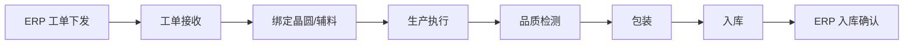

# Galaxycore MES 系统概览

## 一、系统定位

MyCIM2 MES（Manufacturing Execution System）是 Galaxycore 半导体制造现场的核心执行系统，负责衔接计划层与生产层，覆盖从工单接收、物料绑定、生产执行、品质控制到成品入库的全过程管理。

### ISA-95 层级定位

```text
Level 4：ERP / 经营管理层
- 工单下发
- 物料与库存计划
- 财务与经营管理

Level 3：MES / 制造执行层
- 工单管理
- 在制追踪
- 工艺执行
- 品质卡控
- 生产履历

Level 2：SCADA / 设备控制层
- 设备状态采集
- 设备结果上传
- 测试数据交互

Level 1：设备与传感层
- Prober
- Handler
- Tester
- 产线设备与传感器

Level 0：物理生产过程
- 晶圆加工
- 封装
- 测试
- 包装
```

## 二、业务范围

### 2.1 产线类型

| 产线代码  | 产品分类  | 业务描述       | 典型场景                |
| ----- | ----- | ---------- | ------------------- |
| `4`   | COM   | 芯片封装业务     | 晶圆绑定、辅料管控、封装过站、包装入库 |
| `1`   | FT    | 成品测试业务     | IQC、ATE、合批、FT、FQC   |
| `5/6` | CP    | 晶圆测试业务     | SensorCP、LCD_CP     |
| `3`   | WLT   | 晶圆级测试/封装测试 | WLFT、WLFTV、WLR      |
| `32`  | FT-AE | 车载成品测试     | 与 FT 类似，但业务要求更严格    |
| -     | RW    | 重工 / Recon | 返工、重测、异常补流程         |
|       |       |            |                     |

### 2.2 核心业务流程



### 2.3 关键业务对象

| 对象 | 说明 | 典型表 |
|------|------|--------|
| 工单（WorkOrder） | 来自 ERP 的生产指令 | `WORKORDER` |
| 批次（Lot） | MES 在制追踪的核心对象 | `LOT` |
| 晶圆（Wafer） | 重要原材料对象 | `WMS_MMS_MATERIAL_LOT_UNIT` |
| 工艺流程（Route） | 生产步骤定义 | `ROUTE` |
| 工步（Step） | 流程中的单个站点 | `ROUTE_STEP` |
| 等级（Grade） | 测试或品质等级 | `BIN_GRADE` |
| 缺陷（Defect） | 不良与异常记录 | `DEFECT` |

## 三、系统模块

### 3.1 工单管理
- 工单接收
- 工单投入
- 工单一览
- 工单生产
- 工单历史记录
- 测试工单计划
- 重测工单投入

### 3.2 制造管理
- LOT 开始 / 结束 / 借料 / 还料
- 包装操作
- FQC / PKG
- RW 相关操作
- 缺陷代码管理

### 3.3 工艺规划
- 产品与工艺流程配置
- 工步定义
- AQL 配置
- FT / COM / CP 配置管理
- 邮件通知相关配置

### 3.4 晶圆管理
- 晶圆接收
- 晶圆处理
- 晶圆退仓库
- 晶圆库存与状态跟踪

### 3.5 品质与辅助管理
- 在线盘点
- 良率卡控
- HOLD / 放行
- 胶水与金线记录
- 用户与权限管理

## 四、系统价值

### 对业务侧
- 统一工单执行口径
- 提高生产过程透明度
- 支撑追溯与异常分析

### 对制造现场
- 规范站点过站流程
- 控制晶圆、辅料、包装等关键物料流转
- 实现品质规则在线卡控

### 对 IT 与实施侧
- 提供标准业务对象与流程沉淀
- 便于对接 ERP、WMS、设备系统
- 便于做问题排查与运维支持

## 五、相关文档

- [[01-技术架构]] - 技术栈与系统分层
- [[02-模块关系图]] - 模块依赖与数据流
- [[03-集成接口]] - ERP / WMS / 设备集成说明
- [[MES功能导航]] - 功能入口导航
- [[业务培训/流程&名词解释]] - 业务术语与流程说明
