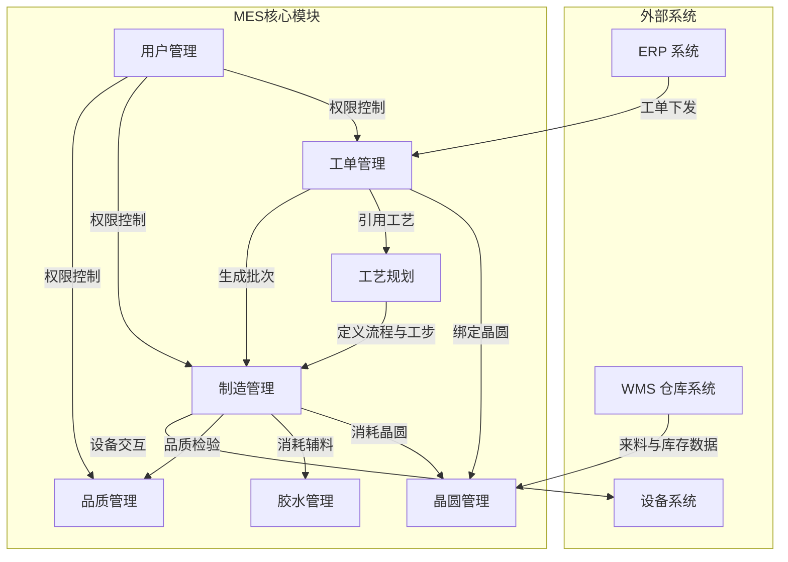
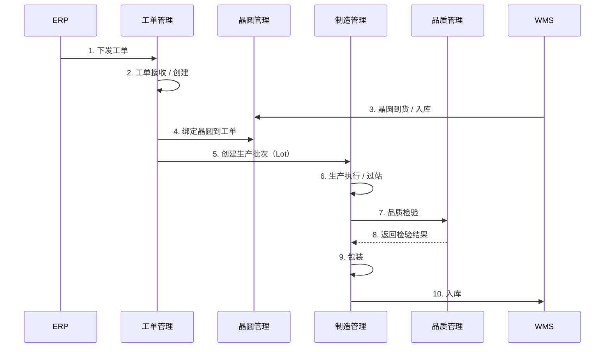
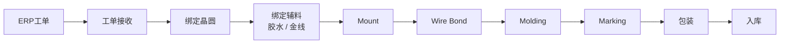
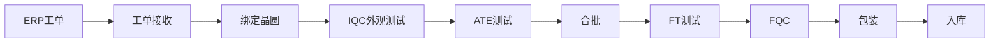
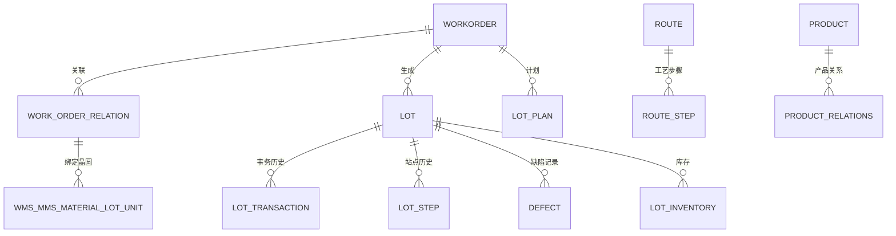

# Galaxycore MES 模块关系图

## 一、模块依赖关系

## 二、核心数据流

### 2.1 工单到入库主流程

### 2.2 COM 产线典型流程

### 2.3 FT 产线典型流程

## 三、核心数据表关系

### 关键表说明

| 表名 | 用途 | 关键字段 |
|------|------|---------|
| `WORKORDER` | 工单主表 | `WORKORDER_ID`, `PRODUCT_CLASSIFY`, `STATUS` |
| `LOT` | 批次主表 | `LOT_ID`, `WORKORDER_ID`, `INNER_ORDER_NO` |
| `LOT_TRANSACTION` | 批次事务历史 | `LOT_ID`, `TRANSACTION_TYPE`, `CREATE_TIME` |
| `LOT_STEP` | 站点历史 | `LOT_ID`, `STEP_ID`, `START_TIME`, `END_TIME` |
| `WMS_MMS_MATERIAL_LOT_UNIT` | 晶圆库存 | `UNIT_ID`, `MATERIAL_LOT_ID`, `STATE` |
| `WORK_ORDER_RELATION` | 工单与物料关系 | `WORK_ORDER_RRN`, `OBJECT_TYPE`, `OBJECT_RRN` |
| `ROUTE` | 工艺流程 | `ROUTE_ID`, `ROUTE_NAME` |
| `ROUTE_STEP` | 工艺步骤 | `ROUTE_ID`, `STEP_ID`, `STEP_SEQ` |
| `DEFECT` | 缺陷记录 | `LOT_ID`, `DEFECT_CODE`, `QTY` |
| `PRODUCT_RELATIONS` | 产品关联配置 | `PRODUCT_ID`, `BIN_GRADE` |

## 四、模块间调用关系

| 调用方 | 被调用方 | 场景 |
|--------|---------|------|
| 工单管理 | 工艺规划 | 获取产品工艺流程、BOM、配置 |
| 工单管理 | 晶圆管理 | 查询可用晶圆、绑定晶圆 |
| 制造管理 | 工单管理 | 校验工单状态、更新 WIP |
| 制造管理 | 工艺规划 | 获取工步配置、AQL 标准 |
| 制造管理 | 晶圆管理 | 消耗晶圆、退仓、状态变更 |
| 制造管理 | 胶水管理 | 记录辅料消耗 |
| 品质管理 | 制造管理 | HOLD / 放行批次 |
| 用户管理 | 全模块 | 菜单、按钮、权限控制 |

## 五、相关文档

- [[00-系统概览]] - 系统业务概览
- [[01-技术架构]] - 技术架构说明
- [[03-集成接口]] - 外部系统集成说明
- [[工单投入]] - 工单投入流程
- [[业务培训/COM业务流程]] - COM 业务流程
- [[业务培训/FT-MES-PROCESS]] - FT 业务流程
