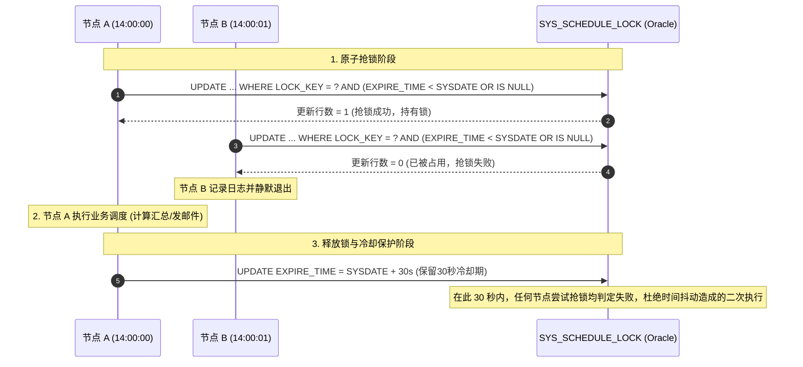

# 集群定时任务分布式锁设计方案 (SYS_SCHEDULE_LOCK)

## 一、 背景与挑战

MES 系统通常采用 **WebLogic 集群多节点多实例** 部署（例如 Node A、Node B 运行相同的应用程序以保证高可用和负载均衡）。

在单体 Spring 定时调度体系中：
* 注解 `@Scheduled` 会在**集群中的每一个节点上独立启动调度线程**；
* 当触发时间一到，所有存活节点会同时开始执行相同的任务；
* **问题隐患**：
  1. 重复计算浪费数据库与 CPU 算力；
  2. 产生并发写冲突或数据重复（如多节点同时向外部接口推送、重复生成单据）；
  3. 重复向业务和管理团队发送多封一模一样的汇总邮件。

为了在**不引入 Redis / Zookeeper 等外部中间件**的前提下，彻底解决多节点并发重复执行问题，设计了基于 Oracle 关系型数据库的**行级原子分布式锁组件**。

---

## 二、 架构核心机制

分布式锁的核心生命周期由 **抢锁 -> 执行 -> 释放与冷却保护** 组成：



### 1. 原子抢锁 (`tryLock`)
利用数据库底层行锁特性，单条 SQL 实现**测试并置位（Test-and-Set）**：
```sql
UPDATE SYS_SCHEDULE_LOCK
SET LOCKED_BY = ?,
    LOCKED_TIME = SYSDATE,
    EXPIRE_TIME = SYSDATE + (? / (24.0 * 60.0))
WHERE LOCK_KEY = ? 
  AND (EXPIRE_TIME < SYSDATE OR EXPIRE_TIME IS NULL);
```
* 只有当锁已过期或从未加锁时，`UPDATE` 才会影响 1 行数据；
* 数据库排他行锁天然保证多节点并发下**有且仅有一个节点更新成功**，其余节点返回受影响行数为 0。

### 2. 防宕机死锁（Timeout 机制）
* 抢锁时设置了合理的过期时间（如 `SYSDATE + 10分钟`）；
* 即使持有锁的节点在执行过程中遭遇操作系统宕机、进程被 `kill -9` 或断电，锁也会在到达 `EXPIRE_TIME` 后自动失效，保证下一次调度正常执行，绝不死锁。

### 3. 冷却保护期（Cooldown 机制）
* **痛点**：若任务执行速度极快（如 2 秒完成），执行完如果直接物理清空锁，其他节点的定时器可能由于服务器时间偏差（NTP 抖动 1-3 秒）在第 3 秒触发并再次抢锁成功。
* **解法**：执行成功后，不是将锁过期时间置为空，而是将其延续更新为：
  `EXPIRE_TIME = SYSDATE + (cooldownSeconds / 86400.0)`
  在设定的冷却保护期（如 30 秒或 60 秒）内阻止任何节点重复执行。

### 4. 管理端强制透传 (`forceLock`)
* 提供给后台运维或管理 API，即使当前锁处于保护期，传入 `force=true` 即可强行重置锁并立刻触发执行。

---

## 三、 数据表结构设计与 DDL

```sql
-- 1. 创建分布式任务锁表
CREATE TABLE SYS_SCHEDULE_LOCK (
    LOCK_KEY        VARCHAR2(100) NOT NULL,            -- 任务唯一标识（主键）
    LOCKED_BY       VARCHAR2(100),                     -- 当前/上次持有锁的主机名或节点标识
    LOCKED_TIME     DATE,                              -- 上次加锁时间
    EXPIRE_TIME     DATE,                              -- 锁过期时间 / 冷却保护截止时间
    DESCRIPTION     VARCHAR2(255),                     -- 任务说明
    CONSTRAINT PK_SYS_SCHEDULE_LOCK PRIMARY KEY (LOCK_KEY)
);

-- 2. 添加表与字段注释
COMMENT ON TABLE SYS_SCHEDULE_LOCK IS '集群定时任务分布式调度锁表';
COMMENT ON COLUMN SYS_SCHEDULE_LOCK.LOCK_KEY IS '任务唯一标识/锁Key';
COMMENT ON COLUMN SYS_SCHEDULE_LOCK.LOCKED_BY IS '当前抢占锁的节点主机名/标识';
COMMENT ON COLUMN SYS_SCHEDULE_LOCK.LOCKED_TIME IS '最后一次加锁时间';
COMMENT ON COLUMN SYS_SCHEDULE_LOCK.EXPIRE_TIME IS '锁过期时间/冷却保护期截止时间';
COMMENT ON COLUMN SYS_SCHEDULE_LOCK.DESCRIPTION IS '任务描述说明';

-- 3. 任务锁预置初始记录示例
INSERT INTO SYS_SCHEDULE_LOCK (LOCK_KEY, LOCKED_BY, LOCKED_TIME, EXPIRE_TIME, DESCRIPTION)
VALUES ('COM_EXP_WO_SUMMARY', NULL, NULL, NULL, 'COM实验工单入库数据汇总定时任务');

COMMIT;
```

---

## 四、 核心代码组件使用指南

组件位于 `com.mycim.gc.utils.ClusterScheduleLockHelper`。

### 1. 标准定时任务调用范式

```java
@Component
public class MyScheduleTask {

    public static final String TASK_LOCK_KEY = "MY_SCHEDULE_TASK";

    @Autowired
    private ClusterScheduleLockHelper lockHelper;

    @Scheduled(cron = "0 0/10 * * * ?") // 每10分钟执行一次
    public void executeTask() {
        // 参数说明：
        // 1. 锁Key: TASK_LOCK_KEY
        // 2. force: 是否强制执行（定时调用传 false，接口调用可传 true）
        // 3. lockTimeoutMinutes: 锁超时时间（防死锁，如 10 分钟）
        // 4. cooldownSeconds: 冷却保护期（防集群重复执行，如 60 秒）
        // 5. 回调接口: 实际业务逻辑
        lockHelper.executeWithLock(TASK_LOCK_KEY, false, 10, 60, new ClusterScheduleLockHelper.LockCallback() {
            @Override
            public void execute() {
                // 业务代码：此时已安全独占锁，且 ThreadLocalContext 已就绪
                doBusinessSchedule();
            }
        });
    }
}
```

### 2. 为什么选择模板回调而非 AOP 切面？

在前期设计中，团队曾规划了基于 `@ClusterScheduleLock` 注解与 Spring AOP 的全局切面。但在旧环境实测中发现：
1. **AspectJ 字节码兼容性限制**：旧版本 `aspectjweaver` 在 JDK 1.7 / WebLogic 10.3.6 下解析 `@annotation(...)` 切点表达式时容易触发语法兼容报错；
2. **类内部调用代理失效问题**：`@Scheduled` 调用类内部私有或同类方法时无法天然触发 Spring 代理，需额外通过 `@Lazy` 注入 `self`，代码可读性降低；
3. **模板回调优势**：`lockHelper.executeWithLock(...)` 仅有 20 行纯 Java 逻辑，**零字节码侵入、零配置要求、100% 免疫类加载器冲突**，运行极度稳定可控。

---

## 五、 运维与诊断 SQL

#### 1. 查询当前各任务锁持有情况
```sql
SELECT LOCK_KEY,
       LOCKED_BY,
       TO_CHAR(LOCKED_TIME, 'yyyy-mm-dd hh24:mi:ss') AS 加锁时间,
       TO_CHAR(EXPIRE_TIME, 'yyyy-mm-dd hh24:mi:ss') AS 到期时间,
       CASE 
           WHEN EXPIRE_TIME > SYSDATE THEN '锁定中/冷却中'
           ELSE '空闲可抢锁'
       END AS 当前状态,
       DESCRIPTION
FROM SYS_SCHEDULE_LOCK;
```

#### 2. 紧急手动释放锁
```sql
-- 将到期时间提前，下一秒即可重新抢锁执行
UPDATE SYS_SCHEDULE_LOCK
SET EXPIRE_TIME = SYSDATE - (1.0 / 86400.0)
WHERE LOCK_KEY = 'COM_EXP_WO_SUMMARY';

COMMIT;
```
