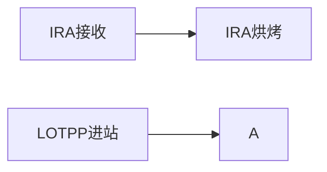

### 一、第一步：IRA 烘烤站点数据落地（SQL 实现）

#### 1. 烘烤状态更新（历史表）

**目标**：将 IRA 批次状态改为`BAKE`，写入历史表留存记录。

```sql
SELECT * FROM GC_IRA_LOT_HIS gil ;
```

---

### 二、第二步：中间表设计（存储 IRA - 机台绑定关系）

**新建绑定表** `GC_IRA_MACHINE_BIND`，用于记录已烘烤 IRA 与机台的绑定及消耗情况：

```sql
CREATE TABLE GC_IRA_MACHINE_BIND (
    BIND_ID          NUMBER(18) PRIMARY KEY,  -- 主键（建议用序列/自增）
    IRA_NAME         VARCHAR2(100) NOT NULL,  -- 对应GC_IRA_LOT.NAME
    MACHINE_ID       VARCHAR2(50) NOT NULL,   -- 目标机台号
    BIND_QTY         NUMBER(10) NOT NULL,     -- 绑定的IRA总数量
    CONSUMED_QTY     NUMBER(10) DEFAULT 0,    -- 已消耗数量
    BIND_TIME        DATE NOT NULL,           -- 绑定时间
    CREATE_USER      VARCHAR2(50),            -- 操作人
    CREATE_TIME      DATE NOT NULL,
    UPDATE_USER      VARCHAR2(50),
    UPDATE_TIME      DATE
);

-- 新建索引（提升查询效率）
CREATE INDEX IDX_IRA_MACHINE ON GC_IRA_MACHINE_BIND(IRA_NAME, MACHINE_ID);
CREATE INDEX IDX_MACHINE ON GC_IRA_MACHINE_BIND(MACHINE_ID);
```

---

### 三、接口 1：IRA 绑定接口（扫描后存绑定关系）

#### 1. 接口定义

- **URL**：`/EquipmentMaterialController/iraBind`
- **方法**：POST
- **请求体**：

```json
{
  "iraName": "48000172_210702R_006",
  "machineId": "PP-001",
  "bindQty": 10,
  "userName": "admin"
}
```

#### 2. 核心代码（Spring 版）

```java
@PostMapping(value = "/iraBind", produces = "application/json; charset=utf-8")
@ResponseBody
public String iraBind(@RequestBody String requestString) {
    JSONObject result = new JSONObject();
    try {
        JSONObject req = JSONObject.parseObject(requestString);
        String iraName = req.getString("iraName");
        String machineId = req.getString("machineId");
        int bindQty = req.getIntValue("bindQty");
        String userName = req.getString("userName");

        // 1. 校验IRA是否已烘烤
        String iraStatus = jdbcTemplate.queryForObject(
            "SELECT STATUS FROM GC_IRA_LOT WHERE NAME = ?", 
            String.class, iraName
        );
        if (!"BAKE".equals(iraStatus)) {
            result.put("code", 400);
            result.put("msg", "IRA未完成烘烤，无法绑定机台");
            return result.toJSONString();
        }

        // 2. 插入绑定记录
        jdbcTemplate.update(
            "INSERT INTO GC_IRA_MACHINE_BIND (BIND_ID, IRA_NAME, MACHINE_ID, BIND_QTY, CONSUMED_QTY, BIND_TIME, CREATE_USER, CREATE_TIME) " +
            "VALUES (GC_IRA_BIND_SEQ.NEXTVAL, ?, ?, ?, 0, SYSDATE, ?, SYSDATE)",
            iraName, machineId, bindQty, userName
        );

        result.put("code", 200);
        result.put("msg", "IRA绑定机台成功");
    } catch (Exception e) {
        log.error("IRA绑定异常", e);
        result.put("code", 500);
        result.put("msg", "绑定失败：" + e.getMessage());
    }
    return result.toJSONString();
}
```

---

### 四、接口 2：Lot 过站接口（校验并消耗 IRA）

#### 1. 接口定义

- **URL**：`/EquipmentMaterialController/lotPass`
- **请求体**：

```json
{
  "lotId": "LOT-12345",
  "machineId": "PP-001",
  "requiredQty": 5,  // 该Lot需要消耗的IRA数量
  "userName": "admin"
}
```

#### 2. 核心代码（含事务 + 扣减逻辑）

```java
@PostMapping(value = "/lotPass", produces = "application/json; charset=utf-8")
@ResponseBody
@Transactional(rollbackFor = Exception.class)  // 开启事务，保证扣减和过站原子性
public String lotPass(@RequestBody String requestString) {
    JSONObject result = new JSONObject();
    try {
        JSONObject req = JSONObject.parseObject(requestString);
        String lotId = req.getString("lotId");
        String machineId = req.getString("machineId");
        int requiredQty = req.getIntValue("requiredQty");
        String userName = req.getString("userName");

        // 1. 查询该机台可用IRA总数量
        Integer availableQty = jdbcTemplate.queryForObject(
            "SELECT SUM(BIND_QTY - CONSUMED_QTY) FROM GC_IRA_MACHINE_BIND WHERE MACHINE_ID = ?",
            Integer.class, machineId
        );
        availableQty = availableQty == null ? 0 : availableQty;

        if (availableQty < requiredQty) {
            result.put("code", 400);
            result.put("msg", "机台IRA可用数量不足，当前剩余：" + availableQty);
            return result.toJSONString();
        }

        // 2. 扣减IRA（按绑定记录顺序消耗，避免超扣）
        List<Map<String, Object>> bindList = jdbcTemplate.queryForList(
            "SELECT BIND_ID, (BIND_QTY - CONSUMED_QTY) AS AVAIL FROM GC_IRA_MACHINE_BIND WHERE MACHINE_ID = ? AND (BIND_QTY - CONSUMED_QTY) > 0 ORDER BY BIND_TIME",
            machineId
        );
        int needConsume = requiredQty;
        for (Map<String, Object> bind : bindList) {
            if (needConsume <= 0) break;
            Long bindId = (Long) bind.get("BIND_ID");
            int avail = ((Number) bind.get("AVAIL")).intValue();
            int consume = Math.min(avail, needConsume);
            
            // 执行扣减
            jdbcTemplate.update(
                "UPDATE GC_IRA_MACHINE_BIND SET CONSUMED_QTY = CONSUMED_QTY + ?, UPDATE_USER = ?, UPDATE_TIME = SYSDATE WHERE BIND_ID = ?",
                consume, userName, bindId
            );
            
            // 记录IRA消耗历史（可选：新建GC_IRA_CONSUME_HIS表）
            jdbcTemplate.update(
                "INSERT INTO GC_IRA_CONSUME_HIS (CONSUME_ID, LOT_ID, IRA_NAME, MACHINE_ID, CONSUME_QTY, CONSUME_TIME, USER_NAME) " +
                "VALUES (GC_IRA_CONSUME_SEQ.NEXTVAL, ?, (SELECT IRA_NAME FROM GC_IRA_MACHINE_BIND WHERE BIND_ID = ?), ?, ?, SYSDATE, ?)",
                lotId, bindId, machineId, consume, userName
            );
            needConsume -= consume;
        }

        // 3. 执行Lot过站（调用MyCIM原有Service或更新Lot状态）
        // 示例：假设MyCIM原有方法 mycimLotService.passStation(lotId, machineId, userName)
        mycimLotService.passStation(lotId, machineId, userName);

        result.put("code", 200);
        result.put("msg", "Lot过站成功，消耗IRA数量：" + requiredQty);
    } catch (Exception e) {
        log.error("Lot过站异常", e);
        TransactionAspectSupport.currentTransactionStatus().setRollbackOnly();  // 手动回滚
        result.put("code", 500);
        result.put("msg", "过站失败：" + e.getMessage());
    }
    return result.toJSONString();
}
```

---

### 五、关键注意事项

1. **事务一致性**：`lotPass`接口必须加`@Transactional`，保证 IRA 扣减和 Lot 过站要么都成功，要么都回滚，避免数据不一致。
2. **并发控制**：扣减时用`SELECT FOR UPDATE`或乐观锁（如版本号），防止多机台同时扣减导致超卖。
3. **历史追溯**：所有状态变更（烘烤、绑定、消耗、过站）都要写入历史表，方便后续排查问题。
4. **MyCIM 适配**：Lot 过站逻辑尽量复用 MyCIM 原有 Service（如`LotService.passStation`），不要重写核心业务。

---

### 六、Postman 测试示例

#### 1. 绑定 IRA

- **URL**：`http://{IP}:{PORT}/EquipmentMaterialController/iraBind`
- **请求体**：

```json
{
  "iraName": "48000172_210702R_006",
  "machineId": "PP-001",
  "bindQty": 10,
  "userName": "admin"
}
```

- **返回**：`{"code":200,"msg":"IRA绑定机台成功"}`

#### 2. Lot 过站

- **URL**：`http://{IP}:{PORT}/EquipmentMaterialController/lotPass`
- **请求体**：

```json
{
  "lotId": "LOT-12345",
  "machineId": "PP-001",
  "requiredQty": 5,
  "userName": "admin"
}
```

- **返回**：`{"code":200,"msg":"Lot过站成功，消耗IRA数量：5"}`

# 七、？
我可以按照扫IRA就绑机台啊，扫LOT就出站啊，不用新增表，就按照原IRA那套， 只不过更加方便，在机台能直接操作MES。

烘烤站
1. 扫描IRA执行烘烤操作，系统将自动记录烘烤历史并支持查询，用于标识IRA已完成烘烤；
2. IRA烘烤后会触发类似IRA发料的业务动作，需在批次（lot）库存表中创建对应记录，以便后续绑定机台；
3. 机台设备定义需与IRA完成关联。

## 20260319 出站的接口
出站接口完成了，现在就是需要写ira烘烤，以及绑定机台的接口

## 20260325
完成的差不多了，先上线uat，然后测试试下
