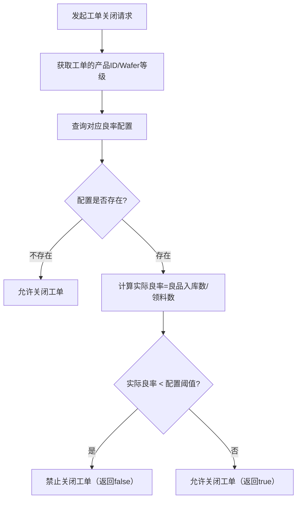

## 一、功能概述

本功能包含两部分核心能力：

1. 基础能力：维护工单良率配置数据（新增 / 查询 / 修改 / 删除），为良率校验提供配置依据；
2. 核心校验能力：工单关闭前校验「实际良率（良品入库数 / 领料数）」是否低于配置的良率阈值，若低于则禁止关闭工单，保障工单生产良率符合预设标准。

## 二、数据库设计（无新增，复用原表）

复用原 `WORK_ORDER_YIELD_CONFIG` 表，核心字段仍为：`PRODUCT_ID`（产品 ID）、`WAFER_LEVEL`（Wafer 等级）、`YIELD`（良率阈值）。

## 三、核心业务逻辑（新增工单关闭良率校验）

### 1. 校验流程总览




### 2. 核心校验代码解析

#### （1）良率校验主方法（关键逻辑）

```java
// 工单关闭前良率校验方法（核心逻辑）
public boolean checkWorkOrderYield(WorkOrder workOrder) throws MyCimException {
    // 1. 构建查询条件：按工单的产品ID、Wafer等级匹配配置
    WorkOrderYieldConfig config = new WorkOrderYieldConfig();
    config.setProductId(workOrder.getProductId());
    config.setWaferLevel(workOrder.getWaferLevel());
    // 2. 查询该产品+Wafer等级对应的良率配置
    List<WorkOrderYieldConfig> configs = queryWorkOrderYieldConfig(config);
    
    // 3. 若存在配置，则执行良率校验
    if (!configs.isEmpty()) {
        // 3.1 计算实际良率 = 良品入库数 / 工单领料数（LswReceivedNum）
        double yield = (double) getGoodBinInQty(workOrder.getWorkorderId()) / workOrder.getLswReceivedNum();
        // 3.2 实际良率 < 配置阈值 → 禁止关闭工单
        if (yield < configs.get(0).getYield()) {
            return false;
        }
    }
    // 无配置/校验通过 → 允许关闭工单
    return true;
}
```

#### （2）良品入库数查询方法（`getGoodBinInQty`）

```java
/**
 * 查询工单的良品入库总数
 * @param wo 工单ID（WORKORDER_ID）
 * @return 良品入库数量（无数据返回0）
 * @throws MyCimException 数据库查询异常
 */
public Integer getGoodBinInQty(String wo) throws MyCimException {
    try {
        String sql = " SELECT\n" +
                "\tSUM(mpl.QUANTITY)\n" +
                "FROM\n" +
                "\tMM_PACKED_LOT mpl,\n" +
                "\tMM_PACKED_CHECK_H mpch\n" +
                "WHERE\n" +
                "\tmpl.PACKED_LOT_RRN = mpch.PACKED_LOT_RRN\n" +
                "\tAND mpch.TRANS_TYPE = 'IN' -- 仅统计入库类型\n" +
                "\tAND mpl.PACKED_STATUS IN ('RECEIVED', 'IN', 'RETEST') -- 有效入库状态\n" +
                "\tAND MPL.WORKORDER_ID = '" + wo + "' \n" +
                "\tAND MPL.GRADE LIKE '%A' "; -- 仅统计A级良品

        List<Integer> query = iRepository.useSqlQuery(sql, Integer.class);
        if (query.isEmpty()) {
            return 0;
        }
        return query.get(0);
    } catch (Exception e) {
        throw ExceptionHandler.handlerException(e, logger);
    }
}
```

### 3. 方法详情说明

|方法名|入参|返回值|异常类型|核心作用|
|---|---|---|---|---|
|`checkWorkOrderYield`|WorkOrder（工单对象）|boolean|MyCimException|校验工单实际良率是否达标，决定是否允许关闭|
|`getGoodBinInQty`|String wo（工单 ID）|Integer|MyCimException|查询指定工单的 A 级良品入库总数|

### 4. 关键规则说明

1. **良率计算规则**：实际良率 = 良品入库数（A 级） / 工单领料数（`LswReceivedNum`）；
2. **配置匹配规则**：按「产品 ID + Wafer 等级」精准匹配良率配置，仅取第一条配置的阈值；
3. **兜底逻辑**：若无匹配的良率配置，直接允许关闭工单（不做校验）；
4. **良品判定规则**：仅统计 `GRADE LIKE '%A'` 的 A 级良品，且入库状态为 `RECEIVED/IN/RETEST`。

## 四、原有基础功能（复用）

### 1. 数据访问层

- `queryWorkOrderYieldConfig(config)`：按产品 ID/Wafer 等级查询良率配置列表；
- 复用 `WORK_ORDER_YIELD_CONFIG` 表的 CRUD 方法。

### 2. 实体类

- `WorkOrderYieldConfig`：包含 `productId`/`waferLevel`/`yield` 核心字段，Getter/Setter 方法。

## 五、异常处理

1. `getGoodBinInQty` 方法中，数据库查询异常会被捕获并封装为 `MyCimException`，统一通过 `ExceptionHandler.handlerException` 处理；
2. 若工单领料数 `LswReceivedNum` 为 0，会触发除零异常，建议补充前置校验：

```java
    if (workOrder.getLswReceivedNum() == 0) {
        throw new MyCimException("工单领料数为0，无法计算良率");
    }
```

## 六、部署与维护提示

### 1. 部署注意事项

- 无需修改数据库表结构，仅需新增 / 编译上述 Java 方法，替换至 WebLogic 部署目录；
- 确保 `MM_PACKED_LOT`/`MM_PACKED_CHECK_H` 表有工单 ID（`WORKORDER_ID`）和等级（`GRADE`）字段的索引，避免 SQL 查询性能问题。

### 2. 后续维护

- 若需调整良品判定规则（如新增 B 级良品），修改 `getGoodBinInQty` 方法中的 `MPL.GRADE LIKE '%A'` 条件即可；
- 若需支持多配置匹配（如多条产品 ID+Wafer 等级配置），需调整 `checkWorkOrderYield` 方法中取第一条配置的逻辑；
- 建议补充日志打印（如实际良率、配置阈值），便于问题排查：

```java
logger.info("工单{}实际良率：{}，配置阈值：{}", workOrder.getWorkorderId(), yield, configs.get(0).getYield());
```

## 七、完整代码逻辑回顾（核心）

1. 从工单对象提取产品 ID、Wafer 等级，查询匹配的良率配置；
2. 计算工单实际良率（良品入库数 / 领料数）；
3. 实际良率 < 配置阈值 → 禁止关闭工单；无配置则直接放行；
4. 良品入库数通过关联查询 `MM_PACKED_LOT`/`MM_PACKED_CHECK_H` 表统计 A 级良品。

### 总结

1. 核心校验逻辑是「实际良率 vs 配置阈值」，无配置时不限制工单关闭；
2. 良品入库数通过 SQL 统计 A 级良品，仅包含有效入库状态的数据；
3. 需补充领料数非零校验，避免除零异常，同时建议增加日志提升可维护性。

# 20260326


优化了内容


又加了个工单关单备注，工单良率太低不能关，要关的话要解释下才能关