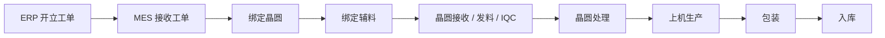
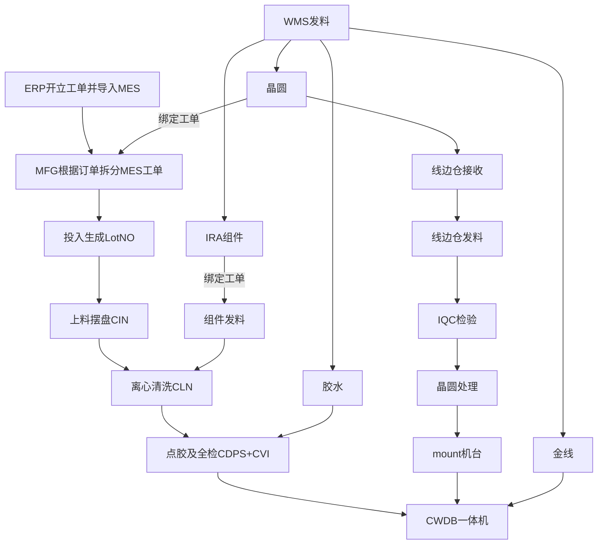
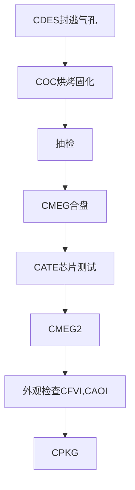
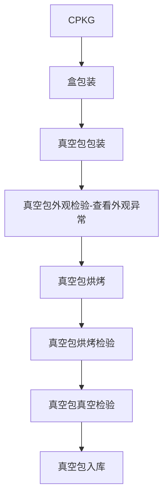

# COM 业务流程

> [!NOTE]
> COM 主要是芯片封装业务，流程长、站点多，除了晶圆之外，还涉及胶水、金线、IRA 组件等多种辅料。MES 在 COM 业务中承担工单接收、物料绑定、过站控制、状态追踪和入库履历记录等职责。

## 一、整体流程概览



## 二、ERP 开立工单并导入 MES

### 2.1 工单来源

工单来自 ERP。ERP 同步后，MES 的工单相关表中会生成对应记录，计划员再在 MES 中接收或推进工单。

### 2.2 常用查询

```sql
-- 查询 MES 工单主表
SELECT t.*, t.rowid
  FROM workorder t
 WHERE t.workorder_id = 'SHST220602001';

-- 查询 ERP 同步过来的工单数据
SELECT *
  FROM erp_workorder t
 WHERE t.workorder_id = 'SHST220602001';

-- 查询工单关联信息
SELECT * FROM work_order_relation;
SELECT * FROM work_order_relation_h;
```

## 三、工单绑定晶圆

### 3.1 对照关系

二级代码通常需要按既定规则截取或转换。工单创建后要先保存，生成必要的对照数据，否则后续可能无法添加晶圆。

### 3.2 组件 IRA 料号

如果组件料号为空，通常不允许继续添加晶圆。因为部分组件信息需要先保存到工单或产品配置中，后续绑定逻辑才有依据。

## 四、产品型号与 BOM

### 4.1 产品型号

在产品定义中，可以查看当前工单产品允许绑定的：
- 晶圆型号
- 胶水 / 金线等辅料
- 对应工艺流程

如果产品没有配置对应晶圆型号，则该工单通常无法绑定晶圆。

### 4.2 晶圆等级与属性匹配

绑定晶圆时，通常需要校验：
- 晶圆等级是否与工单要求一致
- 晶圆属性是否与工单匹配
- 保税属性是否一致

否则系统会禁止绑定。

### 4.3 产品 BOM

BOM 用于定义产品需要使用的物料类型与资源范围，常用于查询：
- 该产品需要哪些辅料
- 哪些物料可以用于当前工单
- 对应资源是否满足配置要求

## 五、晶圆相关流程

## 5.1 晶圆到货与接收

WMS 来料后，晶圆信息会同步到 MES。MES 可通过线边仓接收、发料、IQC、晶圆处理等页面推进状态。

```sql
SELECT *
  FROM backend_wafer_receive t
 WHERE t.box_id = 'SBBSHG210808180';
```

## 5.2 为工单添加晶圆

```sql
-- 查询仓库中某箱晶圆信息
SELECT *
  FROM wms_mms_material_lot_unit t
 WHERE t.material_lot_id = 'SBBSHG210808180';
```

绑定前，晶圆通常没有工单号和投入时间；绑定成功后，再查询晶圆信息时可看到对应工单与投入记录。

## 5.3 线边仓接收

线边仓接收用于确认晶圆已经进入可生产的现场管理范围。接收后，状态会发生变化，供后续发料和 IQC 使用。

## 5.4 线边仓发料

发料后，箱号可能切换为载具号（`CST ID`），线上管理对象也随之变化。常见场景下，发料后会进入等待检验或等待处理状态。

## 5.5 IQC 检验

IQC 主要确认晶圆在正式进入后续处理前的质量状态。发料后，原 `BOX ID` 可能变为 `CST ID`，状态也会切换为待处理类状态。

## 5.6 晶圆处理

```sql
SELECT *
  FROM backend_wafer_receive t
 WHERE t.box_id = 'SBBSHG210808180';

-- 查询某个晶圆的历史操作
SELECT *
  FROM backend_wafer_receive_his t
 WHERE t.wafer_id = 'A01-673Z29.01-132';
```

晶圆处理过程一般会记录到历史表中。即使主表状态变化不明显，历史表也能体现当前步骤，例如水洗、检验、处理完成等。

当所有步骤完成后，晶圆处理结束，状态会进入完成态。

## 5.7 晶圆库存

处理完成的晶圆通常进入在制库存，等待后续 Mount 或生产使用。

```sql
SELECT *
  FROM lot_inventory t
 WHERE t.lot_number = 'A01-673Z29.01-132';
```

常见关注字段：
- `RECEIPT_QTY`：接收数量
- `ISSUE_QTY`：已使用数量
- `ADJUST_QTY`：调整数量

## 六、组件 IRA 流程

### 6.1 物料基础维护

无论是晶圆、金线、胶水、胶带还是刀片，通常都需要先完成物料主数据维护，后续才能用于发料、绑定或退料。

`WIRE OFFSET` 常用于描述金线长度允许的可控范围。

### 6.2 IRA 发料

```sql
-- 查询 IRA 发料表
SELECT * FROM gc_ira_lot;
```

选择批次号后可执行发料。IRA 组件通常偏向上线使用管理，不一定像晶圆一样做完整绑定消耗记录，具体要看业务实现。

### 6.3 IRA 退线边仓

退线边仓时，一般需要选择退料名称、包数，并生成对应标签。

```sql
SELECT * FROM GC_IRA_LOT_HIS WHERE NAME LIKE 'Z0400067_240104R_001';
SELECT * FROM GC_MATERIAL_RETURN_INFO WHERE MATERIAL_RETURN_ORDER_ID = 'IRA240105-004';
SELECT * FROM GC_MATERIAL_RETURN_INFO WHERE MATERIAL_LOT_ID = 'Z0400067_240104R_011';
```

### 6.4 IRA 退仓库

通常只有已经退到线边仓的组件，才能继续退回仓库。

```sql
SELECT t.*, t.rowid
  FROM wms_mms_material_lot t
 WHERE t.material_lot_id = '48000108_220602R_001';

SELECT t.*, t.rowid
  FROM wms_mms_material_lot_his t
 WHERE t.material_lot_id = 'CVSH1911197009';
```

## 七、胶水流程

### 7.1 胶水主表

```sql
SELECT * FROM tool_glue;
```

### 7.2 生成胶水

胶水生成后会进入可管理状态，用于后续绑定和上线使用。

### 7.3 胶水处理

胶水处理一般包含激活、脱泡、使用状态变更等步骤。处理完成后，才能绑定到对应设备或器台使用。

## 八、COM 生产关键辅料与主要工序站点

### 8.1 金线流程与 Mount 操作
## 金线

### 物料库存管理-接受物料

<aside> 💡 添加金线并接收

</aside>


### mount金线


# COM测试流程

## 工单投入建批

💡 你工单创建完 绑完晶圆之后呢 我们可以来做建批投批，完成工单创建和绑定物料，就需要工单投批了


输入工单号开始建批

- `COM_REPKG：重包，站点只有包装`
- `COM_RETEST：重测，只走ATE和手工复测`
- `GC8034-MCFC0：量产，重头开始走`
- `LN_WB_P`


## 工单投批


## 查询工艺流程

填入工艺流程号进行搜索


💡 现在COM的流程已经发生变化了。比如说像上料摆盘 他们已经不用了 他们第一站清洗 清洗完之后呢 点胶也不要了 点胶和或者说点胶目检不要了 过程功能点还是有的 到就ATE之前的话呢 变更变动的话是比较大的 因为频繁的过站呢 对我们的生产上面的人力也是消耗

1. `上料摆盘`：需要的，但不在系统上面记录了
2. `清洗`：清洗你也是要的 因为组件需要去清洗
3. `点胶和画胶目检`：清洗完之后呢 他要给组件上面先抹一层正面的胶 看胶有没有溢出呀 有没有喷胶的时候喷到外面的呀
4. `CWDB一体机`：检完之后呢 我们需要去把芯片从晶圆上面吸出来 放到组件上面 和胶水粘到一起 边缘呢 打上我们的金线去通电 `CWDB`站点是`COM`的最主要的站点 也是他们最主要的一种设备
5. 你沾完胶水 也打完金线了 只有正面没有胶是不管用的 他还要有背面喷胶 背面喷胶呢 也有 也有一些逃气孔 是要把它封住的 他们还有`CDES`站点
6. `CATE`：四种料我已经都组装到一起了 那我需要去检验一下吗 检验完之后呢 我再去ATE那边测试看看我封装好的东西是不是能用呢 能不能出货呢 到底是a级呢 b级呢还是c级呢 还是说完全不能用的报废品呢
7. `CFA`：机台检检了一大半了，那我还有一些少部分的 我要去给人去检验一下
8. `CFVI`：过完手工分析呢 他们还会再有一道人工的检验 主要是检外观，看看有没有裂痕呀
9. `CPKG`：所有的，我们的封装 包括检验全部进行完之后呢 我们到包装 包装边的和ft就很像 也是把芯片放到吹盘上面 盖上盖 先包成小盒 有小盒之后呢 我去包成真空包 有真空包之后呢 我就拿真空包去入库

# 主要站点

## CWDB封装

1. 选择投批的一个批号，开始处理批次
    


    
2. 机台提示没有wafer
    


    
3. 点击物料mount，输入之前工单绑定的物料批次号，不然无法mount
    


    
4. 绑定机台的金线
    


    
5. 结束作业
    
    记录异常的数量和正常完成的数量
    


    
    ```sql
    //查看损失缺陷的数量
    SELECT * FROM trans_reason t where t.instance_rrn = (select lot_rrn from lot where lot_id = 'ZJ220602-0002')
    ```
    


    
    <aside> 💡 晶圆、金线消耗都在`lot_inventory` 表中记录
    
    ```sql
    select from lot_inventory t where t.lot_number in ('A01-673229.01-132', 'W220602001') ;
    ```
    


    
6. 待出组
    


    

## CMEG合盘

<aside> 💡 合盘可以在lot作业，也可以在外面的菜单合盘站合批

</aside>

1. 合盘站合批
    

    
2. 合批后查找数据（**`split_merge_history`**）
    
    💡 可以看到其中一个原批次合批到了新的批次号，并且消耗了170数量
    
    ```sql
    SELECT * FROM split_merge_history t where t.source_lot_id = 'ZJ220602-0002'
    ```
    


💡 合批是先将002和001批次的属性相加到002上，在cpoy002的所有属性并生成一个新的批次ID，所以合批会多出一笔，但是它的源和目的地都是空的，不看的
    


💡 查看批次操作记录
    


查看源批次的状态
    


新批次的状态


3. 待出组
    


## CATE-功能测试

1. 开始处理并结束批次
    


    
2. 测试文件
    
    1. 工步定义查找FTP名称
        


        
    2. FTP定义找到对应的IP，连接上FTP服务
        


        


        
    3. 找到机台号，进入对应文件夹下
        

   


        
    4. 复制一份到本地，修改名字为**`lotid`** + 时间戳，修改里面的**`waferid`**（**`lotid`**），并且所有记录的**`数量之和要等于批次的数量属性`，`item_num`的数量和也必须和`lastqty`的数量一致**
        


        
    5. 将修改好的文件重新复制到原来的文件夹下
        

        
    6. 读取文件失败，这里是删除对应的文件里的缺陷代码
        


        
    7. 读取文件成功，可以查看数量，修改数量，lastqty和qty的总和必须一致，点击计算，出站
        


        

## 外观全检CFVI

### 配置bingroup


### **`设置等级`**


💡 记录完等级，都会在wip_lot_die_bin表里记录

## 包装CPKG

1. 出入组批次号
    


    
2. 盒包装
    


    1. 盒标准数：一盒多少数量
    2. golden标准数：良品中的良品
    3. 包装：包装 **`总颗数 / 盒标准数量`** 的盒数
    4. 散包：包装`一盒`数量为盒标准数的盒
3. 真空包包装
    

    

    
4. 真空包外观检验，查看外观异常
    

    
    - PASS：通过
    - NG：需要重测
5. 真空包烘烤
    
    - 只有良品需要烘烤
6. 真空包烘烤检验
    


`可以去产品定义里看需要的烘烤时间限制`


    
7. 真空包真空检验
    
    1. 如果正确，就是绿色
        


        
8. 真空包入库
    


# COM流程图








## 九、COM 业务关注点

### 8.1 关键校验项
- 工单是否已成功同步
- 产品型号与 BOM 是否齐全
- 晶圆型号、等级、属性是否匹配
- 保税属性是否一致
- 辅料是否已维护并具备可用状态

### 8.2 常见问题
- 工单保存不完整，导致无法绑定晶圆
- 产品未配置晶圆型号，无法投入
- 晶圆与工单等级不一致，绑定失败
- 线边仓接收 / 发料状态异常，影响后续生产
- IRA / 胶水状态未切换完成，导致上线失败

## 十、相关文档

- [[流程&名词解释]] - 业务术语说明
- [[工单投入]] - 工单投入操作
- [[COM工单晶圆同步|工单晶圆同步]] - 工单与晶圆同步逻辑
- [[晶圆退仓库]] - 晶圆退仓库
- [[In-line线金线及胶水统计表]] - 胶水与金线相关记录
