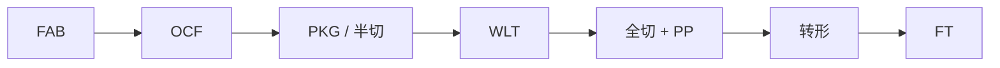
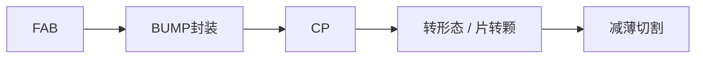
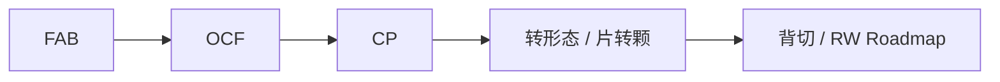

# 流程与名词解释

本文用于帮助新人、实施人员和开发人员快速理解 MES 项目中常见的半导体制造流程术语与产线阶段定义。

## 一、典型流程示意

### 1.1 Sensor-CSP

### 1.2 LCD-COG

### 1.3 Sensor-COM / COB

## 二、常见名词解释

### 2.1 FAB
FAB 通常指晶圆制造工厂或晶圆制造阶段，是半导体产业链中负责晶圆加工制造的核心环节。

### 2.2 Wafer
Wafer 即晶圆，是芯片制造使用的圆形硅片原材料。电路结构在晶圆上形成，再经过切割、测试和封装进入后续流程。

### 2.3 Die
Die 即裸片，是从晶圆上切割出来的单个芯粒，尚未进行封装。

### 2.4 Chip
Chip 即芯片，通常指已经完成切割、筛选并进入封装或可用于成品阶段的器件。

### 2.5 OCF
OCF 是一种与特定载体、基底和封装结构相关的制造或封装工艺缩写，在不同产品线中实际含义可能略有差异，项目中应以现场工艺定义为准。

### 2.6 COG（Chip On Glass）
将 IC 芯片和排线直接安装在玻璃基板上，是较传统的显示封装方式之一，成本较低，但对边框与结构空间占用较大。

### 2.7 COF（Chip On Film）
将驱动 IC 置于柔性排线中，再翻折到屏幕下方，属于 COG 的升级方式，可进一步缩小边框。

### 2.8 COP（Chip On Pi）
常与柔性 OLED 结合使用，边框进一步缩小，但成本和工艺要求更高。

## 三、测试相关术语

### 3.1 CP（Chip Probe）
CP 是晶圆级测试，在封装前通过探针台与测试机配合，对 Wafer 上每颗 Die 做功能和电参数测试。

CP 的主要特点：
- 在晶圆阶段筛除不良 Die
- 降低后续封装与成测成本
- 更直接反映 Wafer 良率
- 测试项目通常较全

### 3.2 FT（Final Test）
FT 是成品测试，对已经封装完成的 Chip 进行功能与电参数测试，确保成品满足出货要求。

FT 的主要特点：
- 针对封装后成品
- 更接近客户使用场景
- 条件更严格，关注关键指标
- 常用于最终放行判断

### 3.3 Probe Card
Probe Card 是 CP 测试中用于连接测试机台与芯片 Pad 点的关键测试工具。

### 3.4 Yield
Yield 指良率，通常用于衡量生产过程中的合格比例，是制造分析和品质控制的重要指标。

## 四、项目中常见理解方式

### CP 与 FT 的区别

| 项目 | CP | FT |
|------|----|----|
| 阶段 | 晶圆测试 | 成品测试 |
| 对象 | Wafer / Die | 已封装 Chip |
| 目的 | 早期筛除不良 | 最终确认出货品质 |
| 关注点 | 制程质量、基础参数 | 成品性能、关键规格 |

### 制造流程中的常见阶段关系
- FAB：前段晶圆制造
- CP：晶圆测试
- PKG：封装
- FT：成品测试
- FQC：最终质量确认
- 入库：成品或中间品入库管理

## 五、使用建议

### 对业务人员
优先掌握：
- FAB、Wafer、Die、Chip
- CP、FT、FQC
- COM、FT、RW、WLT 等产线概念

### 对开发人员
除了术语本身，还要关注：
- 每个术语在系统中的对象表
- 不同阶段对应的状态流转
- 是否涉及特定页面、接口、校验规则

## 六、相关文档

- [[COM业务流程]] - COM 业务流程说明
- [[FT-MES-PROCESS]] - FT 业务流程说明
- [[../00-系统概览]] - 项目整体概览
- [[../MES功能导航]] - 功能入口导航
