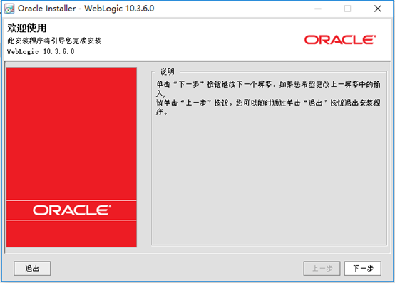

# 三、Oracle数据库的安装，表结构的讲解

# 1. 代码环境

依赖ivy相关（参考文档MyCIM2环境安装.pdf）
依赖weblogic相关（参考文档MyCIM2环境安装.pdf）

# 2. **Weblogic安装与配置**

•  双击，开始安装，欢迎使用页面，下一步

•  选择“创建新的中间件主目录”，可以选择需要安装到的目录，下一步

•  注册安全更新页面，取消勾选（如果取消不掉，变成灰色继续下一步即可）

电子邮件、口令等变灰

下一步，提示“未指定电子邮件地址”，yes

Yes后提示是否跳过，继续yes

勾选“我希望不接受配置中存在的安全问题……”，，继续

•  选择安装类型页面，选择“典型”，下一步

•  Jdk选择页面，浏览并选择本地JDK（使用7版本）

点击“浏览”，选择jdk（到根目录即可）

完成选择，下一步

•  选择产品安装目录页面，默认为一开始选择的路径（此处不建议修改），下一步

•  安装概要页面，下一步

•  开始安装

•  完成安装。勾选“运行Quickstart”.点击完成，进入创建“域”向导

•  也可以先不创建域。需要时通过菜单找到“Quickstart”进行创建

•  选择“Getting started with WebLogic Server 10.3.6”

•  欢迎使用页面，选择创建新的WebLogic域，下一步

•  选择域源页面，默认选择“生成一个自动配置的域以支持下列产品”，下一步

•  指定域名和位置页面，如果本机只安装过一个weblogic，则默认路径不需要修改，下一步；如果是多次安装，需要修改域名，并修改路径为指定的weblogic创建域。

•  配置管理员用户和口令页面，设置用户口令和确认用户口令，并牢记口令。(l4367738.)

•  配置服务器启动模式和JDK页面，选择开发模式；确认可用JDK是否真的可用，如果可用，默认。如果不可用，选择其他jdk，并选择jdk目录。下一步

•  选择可选配置页面，选择“管理服务器”，下一步

•  配置管理服务器，首次安装默认即可。多次安装，修改名称端口等

•  配置概要页面，点击创建进行创建。

•  安装完成后，根据实际需要，选择是否勾选“启动管理服务器”。点击完成。

# 3. 打包

准备：

1. Jdk必须是7版本（具体小版本无所谓）
2. Ant必须是9.7版本以上（小版本低会打包失败，高版本未尝试）
3. 确保代码中的properties文件wl_domains_home设置正确（用于打包后直接将包拷贝至weblogic的发布目录）
4. 确保代码中的properties文件java_home设置正确（可能用于指定打包用的jdk版本）
5. 确保代码中的properties文件wl_home设置正确
6. 确保代码中的properties文件make_home设置正确（可能用于指定要拷贝的包的目录）
7. 代码导入报错时，需要考虑 .ivy 文件夹是否在用户文件夹下生成，若没有生成，或生成路径不对，把项目文件中的 .ivy 文件夹复制到对应用户文件夹下。
8. 修改为自己使用的jdk版本。

确实是否打包成功，成功后会把包移到weblogic对应的发布目录中，重启weblogic。
`Tips`：打包出错时，应该检查JDK和jre是否安装在了同一个文件夹下，安装在同一文件夹下时由于jdk和jre中javac.exe冲突，会导致jre中的javac.exe被删除。

`解决方法`：

1、关闭所有在使用jdk的软件，然后把jdk中的javac.exe复制到jre相应文件夹下，然后把jre文件夹剪切至与jdk不同级（高一级）目录下。

2、卸载重装，安装时弹出安装jre，修改安装路径与jdk安装路径不一致即可。
成功后可通过`ip:7001/mycim2`进入登陆页面。
登陆用户名/密码：`admin/cimm`

# 4. 表结构讲解