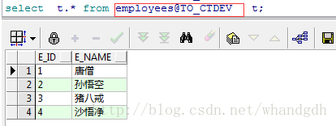

# 四、DB_LINK的创建及使用

[](https://blog.csdn.net/whandgdh/article/details/79286848)

### 3.1 定义

Dblink（database link），英文翻译就是`数据库连接`，就是指不同数据库之间的访问。

### 3.2 语法

```sql
CREATE PUBLIC DATABASE LINK db_link_name CONNECT TO username IDENTIFIED BY password USING '(DESCRIPTION =
    (ADDRESS_LIST =
      (ADDRESS = (PROTOCOL = TCP)(HOST =visist_IP)(PORT =visit_port ))
    )
    (CONNECT_DATA =
      (SERVICE_NAME = db_name)
    )
  )';
  --参数说明
  --username 需要访问数据用户名， password  密码， visit_ip  需要访问数据库的ip，visit_port 窗口， db_name数据库名称
```

### 3. 3 **实例演示**

1. 通过上面sql语句创建

情况是需要在`10.248.100.81`库中用户`cwuser`用户下去访问 库`10.1.2.1`用户`ctdev`的表`employees` ，在没有创建dblink前是不能访问的，如图所示

```sql
CREATE PUBLIC DATABASE LINK TO_CTDEV CONNECT TO ctdev IDENTIFIED BY ctdev2015 USING '(DESCRIPTION =
    (ADDRESS_LIST =
      (ADDRESS = (PROTOCOL = TCP)(HOST =10.1.2.14)(PORT =1521 ))
    )
    (CONNECT_DATA =
      (SERVICE_NAME = ctcore)
    )
  )';
```

在cwuser库中访问表employees，注意这里访问的语法 是`表名 + @ + dblink 名字`



1. 用oracle数据库图像界面创建

创建前先删掉先前创建的dblink 语法如下

```sql
drop public database link  TO_CTDEV
```


注意这里`db_link` 的创建时需要在拥有创建权限，不然是不能创建。

```sql
--mes下  
  --测试环境(登录mestest进行操作)
    --创建dblink(Create database link)
      --1、middle_link
        drop database link MIDDLE_LINK;
        create database link MIDDLE_LINK
          connect to EIFTEST IDENTIFIED BY eiftest
          using '(DESCRIPTION =(ADDRESS_LIST =(ADDRESS =(PROTOCOL = TCP)(HOST = localhost)(PORT = 1521)))(CONNECT_DATA =(SERVICE_NAME = orcl)))';
      --2、source
        drop database link SOURCE;
        create database link SOURCE
          connect to SEMI IDENTIFIED BY semi
          using 'sitri';
      --3、wms_middle_link
        drop database link WMS_MIDDLE_LINK;
        create database link WMS_MIDDLE_LINK
          connect to WMSTEST IDENTIFIED BY wmstest
          using '(DESCRIPTION =(ADDRESS_LIST =(ADDRESS =(PROTOCOL = TCP)(HOST = localhost)(PORT = 1521)))(CONNECT_DATA =(SERVICE_NAME = orcl)))';
    --创建同义词(Create the synonym)
      --1、erp_material_order
        create or replace synonym ERP_MATERIAL_ORDER for EIFTEST.ETM_SO@MIDDLE_LINK;
      --2、erp_workorder
        create or replace synonym ERP_WORKORDER for EIFTEST.ETM_WO@MIDDLE_LINK;
      --3、gc_etm_so
        create or replace synonym GC_ETM_SO for EIFTEST.ETM_SO@MIDDLE_LINK;
      --4、material_order_seq
        create or replace synonym MATERIAL_ORDER_SEQ for EIFTEST.SEQETM_SO@WMS_MIDDLE_LINK;
      --5、wms_mms_material_lot
        create or replace synonym WMS_MMS_MATERIAL_LOT for WMSTEST.MMS_MATERIAL_LOT@WMS_MIDDLE_LINK;
      --6、wms_mms_material_lot_unit
        create or replace synonym WMS_MMS_MATERIAL_LOT_UNIT for WMSTEST.MMS_MATERIAL_LOT_UNIT@WMS_MIDDLE_LINK;
      --7、wms_mms_material_lot_his
        create or replace synonym WMS_MMS_MATERIAL_LOT_HIS for WMSTEST.MMS_MATERIAL_LOT_HIS@WMS_MIDDLE_LINK;
      --8、wms_mms_material_lot_unit_his
        create or replace synonym WMS_MMS_MATERIAL_LOT_UNIT_HIS for WMSTEST.MMS_MATERIAL_LOT_UNIT_HIS@WMS_MIDDLE_LINK;      
      --9、wms_mms_warehouse
        create or replace synonym wms_mms_warehouse for WMSTEST.MMS_warehouse@WMS_MIDDLE_LINK;                        
  --正式环境(登录mesprod进行操作)
    --创建dblink(Create database link)
      --1、middle_link
        drop database link MIDDLE_LINK;
        create database link MIDDLE_LINK
          connect to EIFPROD IDENTIFIED BY eifprod
          using '(DESCRIPTION = (ADDRESS_LIST = (ADDRESS = (PROTOCOL = TCP)(HOST = 10.181.160.22 )(PORT = 1521))
           (ADDRESS = (PROTOCOL = TCP)(HOST =10.181.160.24 )(PORT = 1521)))  (CONNECT_DATA = (SERVICE_NAME = mesdb) ) )';
      --2、source
        drop database link SOURCE;
        create database link SOURCE
          connect to SEMI IDENTIFIED BY semi
          using 'sitri';
      --3、wms_middle_link
        drop database link WMS_MIDDLE_LINK;
        create database link WMS_MIDDLE_LINK
          connect to WMSPROD IDENTIFIED BY wmsprod
          using '(DESCRIPTION = (ADDRESS_LIST = (ADDRESS = (PROTOCOL = TCP)(HOST = 10.181.160.22 )(PORT = 1521))
           (ADDRESS = (PROTOCOL = TCP)(HOST =10.181.160.24 )(PORT = 1521)))  (CONNECT_DATA = (SERVICE_NAME = mesdb) ) )';
    --创建同义词(Create the synonym)
      --1、erp_material_order
        create or replace synonym ERP_MATERIAL_ORDER for EIFPROD.ETM_SO@MIDDLE_LINK;
      --2、erp_workorder
        create or replace synonym ERP_WORKORDER for EIFPROD.ETM_WO@MIDDLE_LINK;
      --3、gc_etm_so
        create or replace synonym GC_ETM_SO for EIFPROD.ETM_SO@MIDDLE_LINK;
      --4、material_order_seq
        create or replace synonym MATERIAL_ORDER_SEQ for EIFPROD.SEQETM_SO@WMS_MIDDLE_LINK;
      --5、wms_mms_material_lot
        create or replace synonym WMS_MMS_MATERIAL_LOT for WMSPROD.MMS_MATERIAL_LOT@WMS_MIDDLE_LINK;
      --6、wms_mms_material_lot_unit
        create or replace synonym WMS_MMS_MATERIAL_LOT_UNIT for WMSPROD.MMS_MATERIAL_LOT_UNIT@WMS_MIDDLE_LINK;
      --7、wms_mms_material_lot_his
        create or replace synonym WMS_MMS_MATERIAL_LOT_HIS for WMSTEST.MMS_MATERIAL_LOT_HIS@WMS_MIDDLE_LINK;
      --8、wms_mms_material_lot_unit_his
        create or replace synonym WMS_MMS_MATERIAL_LOT_UNIT_HIS for WMSTEST.MMS_MATERIAL_LOT_UNIT_HIS@WMS_MIDDLE_LINK;       
      --9、wms_mms_warehouse
        create or replace synonym wms_mms_warehouse for WMSTEST.MMS_warehouse@WMS_MIDDLE_LINK;       
--wms下
  --测试环境(登录wmstest进行操作)
    --创建dblink(Create database link)
      --1、to_erp
        drop database link TO_ERP;
        create database link TO_ERP
          connect to EIFTEST IDENTIFIED BY eiftest
          using '(DESCRIPTION =(ADDRESS_LIST =(ADDRESS =(PROTOCOL = TCP)(HOST = localhost)(PORT = 1521)))(CONNECT_DATA =(SERVICE_NAME = orcl)))';
      --2、to_mes
        drop database link TO_MES;
        create database link TO_MES
          connect to MESTEST IDENTIFIED BY mestest
          using '(DESCRIPTION =(ADDRESS_LIST =(ADDRESS =(PROTOCOL = TCP)(HOST = localhost)(PORT = 1521)))(CONNECT_DATA =(SERVICE_NAME = orcl)))';
    --创建同义词(Create the synonym)
      --1、erp_material_out_order
        create or replace synonym ERP_MATERIAL_OUT_ORDER for EIFTEST.ETM_MATERIAL_OUT@TO_ERP;
      --2、erp_mo
        create or replace synonym ERP_MO for MTE_MO@TO_ERP;
      --3、erp_so
        create or replace synonym ERP_SO for EIFTEST.ETM_SO@TO_ERP;
      --4、mes_packed_lot
        create or replace synonym MES_PACKED_LOT for MESTEST.MM_PACKED_LOT@TO_MES;      
      --5、erp_in_stock
        create or replace synonym erp_in_stock for EIFTEST.MTE_IN_STOCK@TO_ERP;
      --6、erp_material_in   
        create or replace synonym erp_material_in for EIFTEST.MTE_MATERIAL_IN@TO_ERP;
      --7、ERP_MATERIAL_OUT         
        create or replace synonym ERP_MATERIAL_OUT for EIFTEST.MTE_MATERIAL_OUT@TO_ERP;
      --8、ERP_MOA
        create or replace synonym ERP_MOA for EIFTEST.MTE_MOA@TO_ERP;      
      --9、MES_PACKED_LOT_RELATION
        create or replace synonym MES_PACKED_LOT_RELATION for MESTEST.MM_PACKED_LOT_RELATION@TO_MES;
      --10、MES_BACKEND_WAFER_RECEIVE  
        create or replace synonym MES_BACKEND_WAFER_RECEIVE for MESTEST.BACKEND_WAFER_RECEIVE@TO_MES;
      --11、MES_BACKEND_WAFER_RECEIVE_HIS  
        create or replace synonym MES_BACKEND_WAFER_RECEIVE_HIS for MESTEST.BACKEND_WAFER_RECEIVE_HIS@TO_MES;
      --12、MES_GC_WLT_UPLOAD  
        create or replace synonym MES_GC_WLT_UPLOAD for MESTEST.GC_WLT_UPLOAD@TO_MES;                                                  
  --正式环境(登录wmsprod进行操作)
    --创建dblink(Create database link)
      --1、to_erp
        drop database link TO_ERP;
        create database link TO_ERP
          connect to EIFPROD IDENTIFIED BY eifprod
          using '(DESCRIPTION = (ADDRESS_LIST = (ADDRESS = (PROTOCOL = TCP)(HOST = 10.181.160.22 )(PORT = 1521))
           (ADDRESS = (PROTOCOL = TCP)(HOST =10.181.160.24 )(PORT = 1521)))  (CONNECT_DATA = (SERVICE_NAME = mesdb) ) )';
      --2、to_mes
        drop database link TO_MES;
        create database link TO_MES
          connect to MESPROD IDENTIFIED BY mesprod
          using '(DESCRIPTION = (ADDRESS_LIST = (ADDRESS = (PROTOCOL = TCP)(HOST = 10.181.160.22 )(PORT = 1521))
           (ADDRESS = (PROTOCOL = TCP)(HOST =10.181.160.24 )(PORT = 1521)))  (CONNECT_DATA = (SERVICE_NAME = mesdb) ) )';
    --创建同义词(Create the synonym)
      --1、erp_material_out_order
        create or replace synonym ERP_MATERIAL_OUT_ORDER for ETM_MATERIAL_OUT@TO_ERP;
      --2、erp_mo
        create or replace synonym ERP_MO for MTE_MO@TO_ERP;
      --3、erp_so
        create or replace synonym ERP_SO for ETM_SO@TO_ERP;
      --4、mes_packed_lot
        create or replace synonym MES_PACKED_LOT for MM_PACKED_LOT@TO_MES;
```