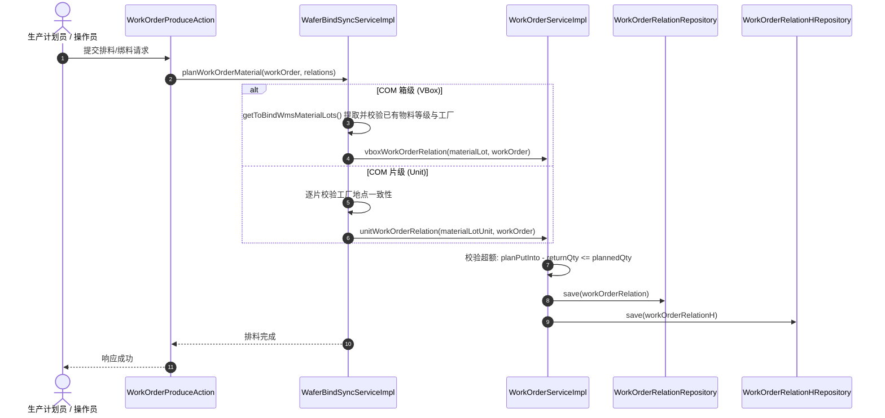

# 工单物料绑定与排产校验功能说明书

---

## 1. 模块背景与业务概述

在半导体封测及晶圆制造执行系统（MES/WIP）中，**工单物料排产绑定**（Work Order Material Binding & Planning）是生产投料流程的核心环节。其主要目标是在生产投产前，将仓库（WMS）在库物料、晶圆片（Unit/Wafer）、真空箱（VBox）或 CP 预入 RW（重工批次）绑定至指定的制造工单（Work Order），并实现数量卡控、等级一致性核对以及跨工厂地点的安全校验。

### 1.1 业务物料层级与来源
- **箱级物料（Box / VBox）**：以真空包或整箱（`WMS_MMS_MATERIAL_LOT`）为最小排产单元（如 COM 重工、Retest VBox 等）。
- **片级物料（Unit / Wafer）**：以单片晶圆（`WMS_MMS_MATERIAL_LOT_UNIT`）为排产单元（如普通 COM 晶圆工单）。
- **CP 预入 RW 批次**：源自 CP 测试完成预入 WIP 的晶圆打包批次（数据存储于 WIP 的 `PACKED_LOT` 表，尚未推入 WMS 仓库表）。

---

## 2. 核心架构与处理流转

### 2.1 整体时序流程



### 2.2 核心校验规则
1. **工厂地点一致性校验**：同一工单内绑定的所有物料，其归属工厂（`factoryId`）必须完全相同，严禁不同工厂地点物料混排在一个工单中。
2. **等级一致性校验**：同一工单内绑定的物料等级（`grade`）必须一致（OIS 产品分类及 Retest 测试工单除外）。
3. **投产计划超额卡控**：工单累计投入量扣除已退料量，不可超出工单计划总数：
   $$\text{planPutInto} - \text{returnQty} \le \text{plannedQty}$$
4. **重复排料防重校验**：物料存在排产预占标记（如 `reserved11`）时，拦截并提示“存在已排料批次”。

---

## 3. 数据模型与字段映射规则

### 3.1 核心数据表
| 表名 | 实体类名 | 说明 |
| :--- | :--- | :--- |
| `PRP_WORKORDER` | `WorkOrder` | 生产工单主表（计划量、已投量、产品型号、工厂等） |
| `PRP_WORK_ORDER_RELATION` | `WorkOrderRelation` | 工单与排产物料的当前绑定关系表 |
| `PRP_WORK_ORDER_RELATION_H` | `WorkOrderRelationH` | 工单物料绑定/解绑的历史轨迹表（记录操作类型、事务快照） |
| `WMS_MMS_MATERIAL_LOT` | `WmsMmsMaterialLot` | 仓库箱级物料批次表 |
| `WMS_MMS_MATERIAL_LOT_UNIT`| `WmsMmsMaterialLotUnit`| 仓库片级/晶圆物料明细表 |
| `PRP_PACKED_LOT` | `PackedLot` | WIP 晶圆打包批次表（CP 预入 RW 关键源数据） |

### 3.2 `WORK_ORDER_RELATION` 字段映射标准化规范

| 字段名 | 箱级 (VBox) 取值 | 片级 (Unit) 取值 | CP 预入 RW 取值 | 说明 |
| :--- | :--- | :--- | :--- | :--- |
| `OBJECT_ID` | `materialLotId` | `unitId` | `lotId` | 唯一对象标识（解绑及回溯主键） |
| `OBJECT_TYPE`| `WO_RETEST_VBOX` | `WO_RESEVED_MLOT` | 传入 `objectType` | 关联对象类型枚举 |
| `WORKORDER_RRN`| `workorderRrn` | `workorderRrn` | `workorderRrn` | 关联工单主键 |
| `WORKORDER_ID` | `workorderId` | `workorderId` | `workorderId` | 关联工单编号 |
| `MATERIAL_LOT_ID`| `materialLotId` | `materialLotId` | `lotPlan.getAttributeData8()` | WMS物料批次号或晶圆原始批号 |
| `LOT_ID` | `lotId` | `lotId` | `lotPlan.getAttributeData8()` | 关联晶圆批号 / CST ID |
| `MLOT_RRN` | `objectRrn` | `materialLotRrn` | `lotPlan.getLotRrn()` | 物料批次系统主键 |
| `MUNIT_RRN` | `null` | `objectRrn` | `null` | 片级物料系统主键 |
| `RECEIVE_QTY`| 物料当前数量（型号匹配时） | 片数量（1） | 晶圆片数 | 扣减/投入数量 |
| `CREATE_TIME`| `new Date()` | `new Date()` | `new Date()` | 排料创建时间（排料列表显示依据） |

---

## 4. 重点问题根因分析与技术重构（Bugfix 记录）

### 4.1 Bug 1：CP 预入 RW 工单追加绑料误报“不同工厂不可排在一个工单”

#### 4.1.1 缺陷现象
CP 预入 RW 类型的工单在初次排料后，后续再次向该工单追加排入新物料时，系统弹出异常中断：
> `MyCimException: 不同工厂不可排在一个工单` 或 `不同等级不能绑定/解绑工单`

#### 4.1.2 根因剖析
1. **数据源回退缺失**：在 `getToBindWmsMaterialLots` 中，系统需要先提取该工单**已有绑定关系**中的物料工厂（`factoryId`）和等级（`grade`）作为基准。原代码仅向 WMS 仓库表（`WmsMmsMaterialLot`）查询。但 CP 预入 RW 物料在此时尚未入库至 WMS，而是以 WIP 打包批次记录在 `PACKED_LOT` 中。导致查 WMS 返回为 `null`，未能提取到已有物料的工厂和等级。
2. **关系索引取值 Bug**：原循环中在判断备选逻辑时写死取第 0 条物料（`relations.getContent().get(0)`），未对遍历中的当前条目 `relation` 取值，导致多条物料时判断错位。
3. **字段存储不规范**：此前保存关系时，将 MES 内部批号赋给 `lotId`，导致通过 CST 号逆向查询 `PACKED_LOT` 时无法命中。

#### 4.1.3 修复措施
- **完善多级数据回退查询**：
  ```java
  for (WorkOrderRelation relation : relations.getContent()) {
      WmsMmsMaterialLot materialLot = wmsMmsMaterialLotRepository.getMmsMaterialLotById(relation.getMaterialLotId());
      if (materialLot == null) {
          materialLot = wmsMmsMaterialLotRepository.getMaterialLotByLotAndWorkorderId(relation.getLotId(), workOrder.getWorkorderId());
      }
      // 回退查询 WIP 打包批次，兼容 CP 预入 RW 数据
      List<PackedLot> packedLotList = packageService.getPackedLotByCstId(relation.getLotId());
      if (!packedLotList.isEmpty()
              && StringUtils.isNotEmpty(packedLotList.get(0).getFactoryId())
              && StringUtils.isNotEmpty(packedLotList.get(0).getGrade())) {
          grade = packedLotList.get(0).getGrade();
          fabLotId = packedLotList.get(0).getFactoryId();
          break;
      }
      if (materialLot != null) {
          grade = materialLot.getGrade();
          fabLotId = materialLot.getFactoryId();
          break;
      }
  }
  ```
- **纠正 CP 预入 RW 的批号存储**：在 `WorkOrderRelation(WorkOrder, LotPlan, String)` 中，明确将原始晶圆批号/CST号（`lotPlan.getAttributeData8()`）赋给 `materialLotId` 与 `lotId`。

---

### 4.2 Bug 2：绑定逻辑散乱与超额卡控重复抽取

#### 4.2.1 缺陷现象
在 `WaferBindSyncServiceImpl` 内，`bindWorkOrderVbox`、`planWorkOrderUnit`、`planComMaterial` 各自重复编写如下逻辑：
- 关系模型实例化与字段赋值；
- 工单 `planPutInto` 手动累加；
- 工单数量超额判断；
- 保存 `WorkOrderRelation` 与写入 `WorkOrderRelationH`。
逻辑冗长分散，极易出现某些分支忘记累加计划量或漏记历史的问题。

#### 4.2.2 修复措施
1. **模型层封装构建器**：在 `WorkOrderRelation` 中增加 `vbox()`、`unit()` 与 `generatorBasic()`，对不同来源物料的属性初始化实行标准化收口。
2. **服务层抽取核心排料接口**：在 `WorkOrderService` 及其实现类 `WorkOrderServiceImpl` 中增加标准服务方法：
   - `void unitWorkOrderRelation(WmsMmsMaterialLotUnit unit, WorkOrder workOrder)`
   - `void vboxWorkOrderRelation(WmsMmsMaterialLot materialLot, WorkOrder workOrder)`
   统一负责：
   - 累加 `planPutInto`；
   - 校验超额 `workOrder.getPlanPutInto() - workOrder.getReturnQty() > workOrder.getPlannedQty()`；
   - 持久化关系主表与历史轨迹表。

---

### 4.3 Bug 3：排料列表“排料时间”为空

#### 4.3.1 根因
排料历史及当前关系展示时，依赖 `createTime` 字段。部分批次和 Unit 在初次生成 `WorkOrderRelation` 时未调用 `setCreateTime(new Date())`，导致数据库字段为 `NULL`，前端显示空白。

#### 4.3.2 修复措施
- 在 `generatorBasic(workOrder)` 及各构造函数中统一补充 `this.createTime = new Date();`。
- 在 `WaferBindSyncServiceImpl.generatorLotAndWorkOrderRelation` 中显式补充 `workOrderRelation.setCreateTime(new Date())` 与 `setWorkOrderId(workOrder.getWorkorderId())`。

---

## 5. 涉及核心代码清单

| 文件路径 | 关键方法 / 改动点 |
| :--- | :--- |
| [`WorkOrderRelation.java`](file:///c:/Users/A0002386/1program/gc/mycim2/core/src/valueobject/src/com/mycim/prp/model/WorkOrderRelation.java) | `vbox()`, `unit()`, `generatorBasic()`，补充 `createTime`，修正 `lotPlan.getAttributeData8()` |
| [`WorkOrderService.java`](file:///c:/Users/A0002386/1program/gc/mycim2/core/src/gc/src/main/java/com/mycim/gc/service/WorkOrderService.java) | 接口声明 `unitWorkOrderRelation`, `vboxWorkOrderRelation` |
| [`WorkOrderServiceImpl.java`](file:///c:/Users/A0002386/1program/gc/mycim2/core/src/gc/src/main/java/com/mycim/gc/service/impl/WorkOrderServiceImpl.java) | 实现统一的工单关系构建、投料量累加、超额卡控与历史表写入 |
| [`WaferBindSyncServiceImpl.java`](file:///c:/Users/A0002386/1program/gc/mycim2/core/src/tool/src/main/java/com/mycim/tool/service/impl/WaferBindSyncServiceImpl.java) | `getToBindWmsMaterialLots` 增加 `PackedLot` 回退查询；`bindWorkOrderVbox`、`planWorkOrderUnit` 统一调用服务层方法 |
| [`WorkOrderProduceAction.java`](file:///c:/Users/A0002386/1program/gc/mycim2/core/src/model/src/com/mycim/webapp/actions/prp/WorkOrderProduceAction.java) | `buildWorkOrderRelations` 抽取公共列表组装方法，强化 `objectId` 兜底取值 |

---

## 6. 运维排查与验证指南

### 6.1 常见报错与排查方向
1. **“不同工厂不可排在一个工单”**
   - 检查本次拟绑定的物料 `factoryId` 与工单已有物料 `factoryId` 是否一致。
   - 若工单已有物料是 CP 预入 RW，核对 `PRP_PACKED_LOT` 中该批次的 `FACTORY_ID` 字段是否存在。
2. **“不同等级不能绑定/解绑工单”**
   - 检查拟绑定物料与工单已排物料的 `grade` 属性是否匹配。
3. **“绑定数量已超过计划工单总数”**
   - 核对公式：$\text{planPutInto} - \text{returnQty} > \text{plannedQty}$。
   - 检查 `PRP_WORKORDER` 中当前工单的 `PLAN_PUT_INTO`、`RETURN_QTY` 与 `PLANNED_QTY`。

### 6.2 常用 SQL 诊断脚本

```sql
-- 1. 查询指定工单当前已绑定的物料关系
SELECT 
    R.OBJECT_RRN,
    R.WORKORDER_ID,
    R.OBJECT_ID,
    R.OBJECT_TYPE,
    R.MATERIAL_LOT_ID,
    R.LOT_ID,
    R.RECEIVE_QTY,
    R.CREATE_TIME
FROM PRP_WORK_ORDER_RELATION R
WHERE R.WORKORDER_ID = 'WO202609090001'
ORDER BY R.CREATE_TIME DESC;

-- 2. 检查 CP 预入 RW 打包物料批次状态及工厂
SELECT 
    P.CST_ID,
    P.LOT_ID,
    P.GRADE,
    P.FACTORY_ID,
    P.QTY
FROM PRP_PACKED_LOT P
WHERE P.CST_ID = 'WAFER_LOT_001';

-- 3. 查验工单投料计划与退料量
SELECT 
    W.WORKORDER_ID,
    W.PLANNED_QTY,
    W.PLAN_PUT_INTO,
    W.RETURN_QTY,
    W.PRODUCT_ID,
    W.PUT_PRODUCT_ID
FROM PRP_WORKORDER W
WHERE W.WORKORDER_ID = 'WO202609090001';
```
